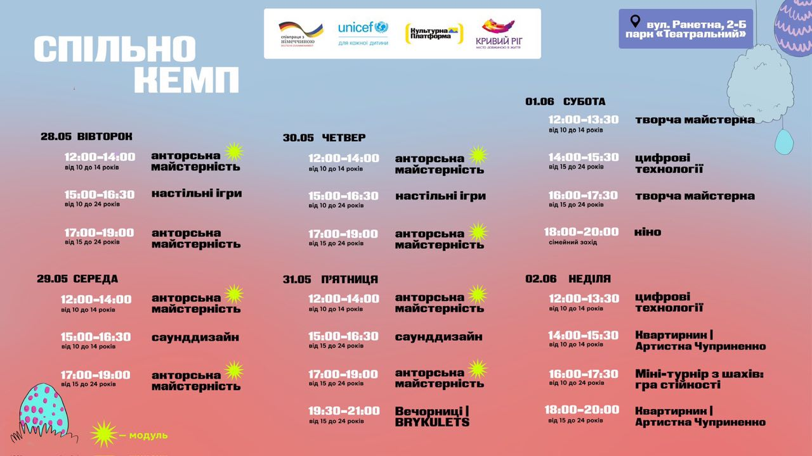
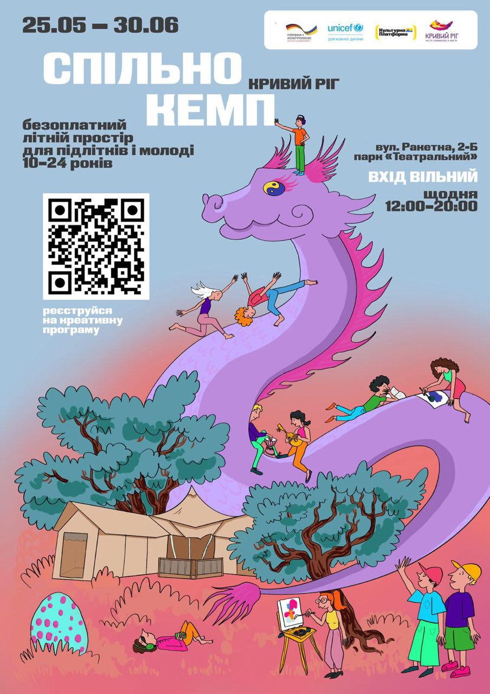

---
title: «СПІЛЬНО КЕМП» вже працює!
---

Не пропустіть безоплатний літній простір для молоді від 10 до 24 років!

Унікальна можливість відвідати творчу програму «Спільно Кемп» та отримати нові знання та навички з хореографії, музики, саунддизайну, графічного дизайну, акторської майстерності, цифрових технологій та просто гарно провести час на музичних вечорах і кінопереглядах. Простір працює щодня з 12:00 до 20:00.

Тут підлітки та молодь беруть участь у різноманітних заходах, майстер-класах, воркшопах, осягають соціально важливі теми та творчі практики.

Де: м. Кривий Ріг, вул. Ракетна, 2-Б, парк «Театральний» (навпроти спортивного клубу «Форест»)

Коли: 25 травня - 30 червня 2024 року

Час роботи: щодня з 12:00 до 20:00

Ознайомитись з розкладом та зареєструватися можна на сайті проєкту - [spilnocamp.cultpz.org](spilnocamp.cultpz.org)

