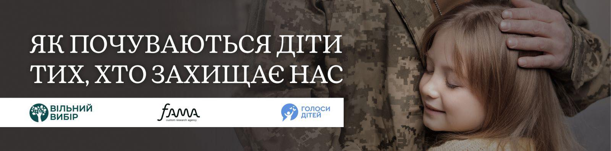
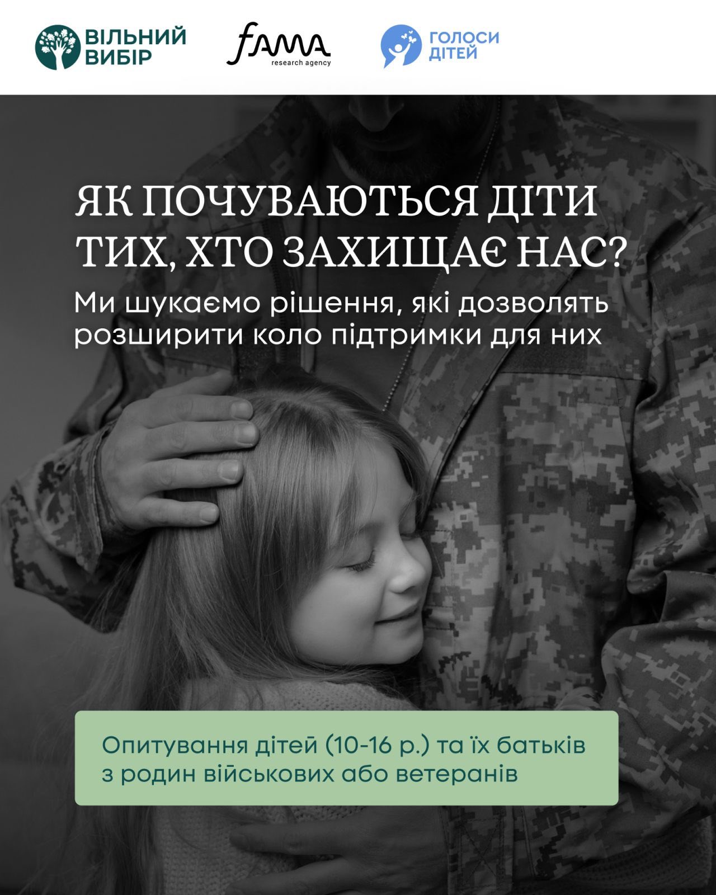

---
title: Всеукраїнське опитування для родин ветеранів, ветеранок, а також військовослужбовців та військовослужбовиць
---

Шановні батьки!

Запрошуємо вас разом із дітьми долучитися до важливого всеукраїнського опитування для родин ветеранів і ветеранок, а також військовослужбовців та військовослужбовиць.

Його мета — краще зрозуміти емоційний стан дітей та визначити, що саме допомагає їм почуватися спокійніше, захищено й підтримано. Отримані результати стануть основою для створення дієвих програм психологічної допомоги.

🔹 Участь передбачена для дітей віком 10–16 років та одного з батьків / законного представника.
🔹 Заповнення анкети триватиме лише 10–15 хвилин.
🔹 Опитування анонімне — без зазначення навчального закладу чи персональних даних.

👉 Долучитися до опитування: https://bit.ly/3K28hUm

Дослідження проводиться на замовлення громадської організації «Вільний вибір» (https://qrfy.io/p/dJvWT48CmI) у партнерстві з агенцією Fama в межах проєкту «EMPOWER: Education, Mental Health, Protection and Opportunities for Well-being and Enhanced Resilience».

Дякуємо за вашу участь та турботу про емоційне благополуччя наших дітей 🌿

