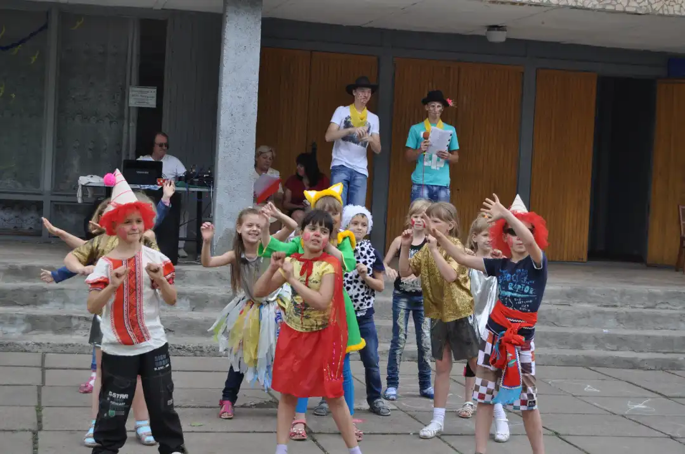
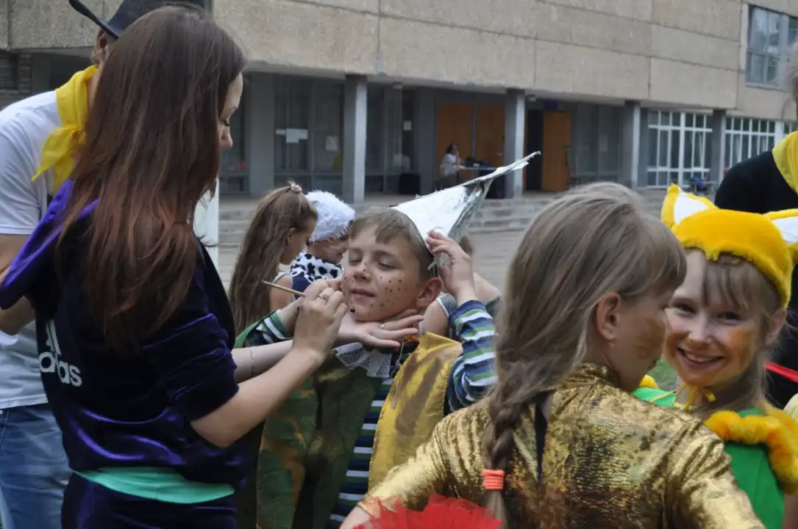
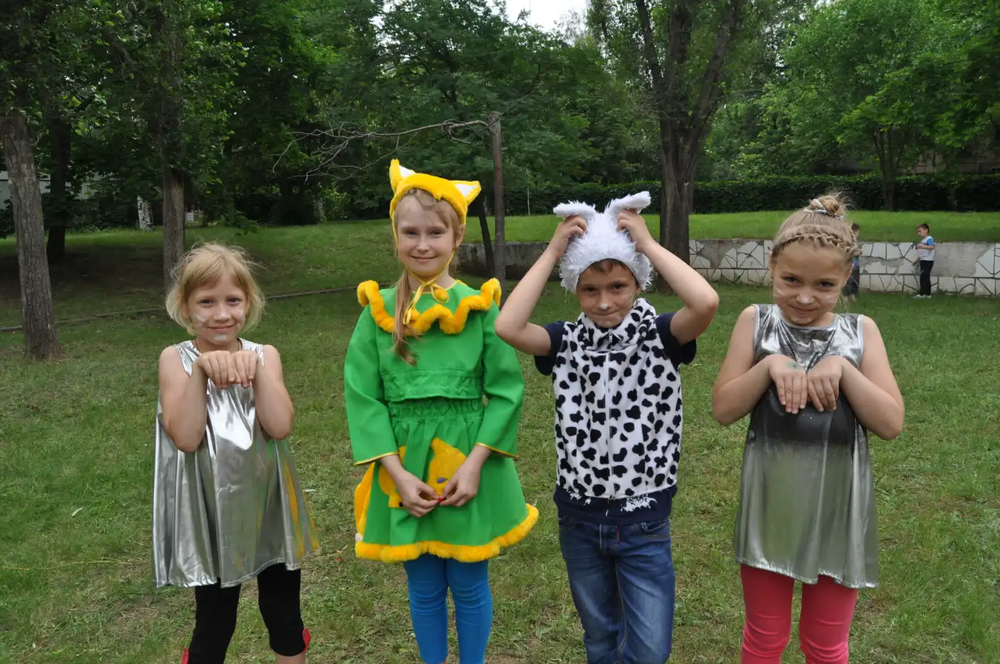
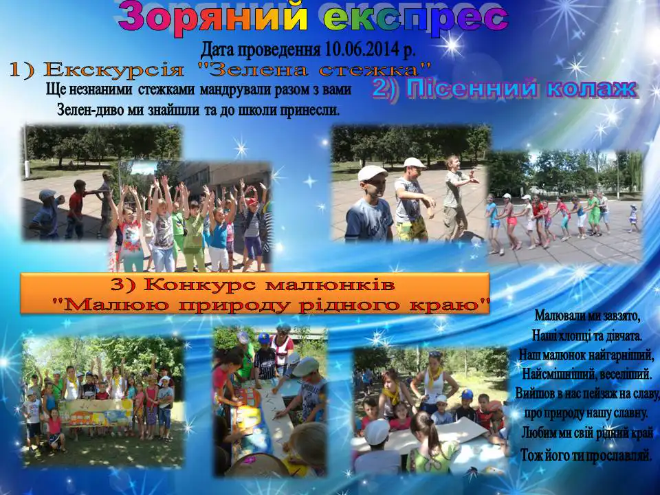
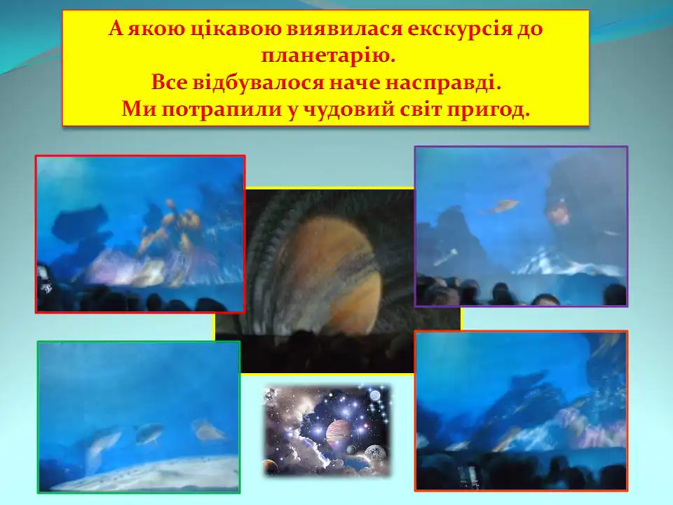
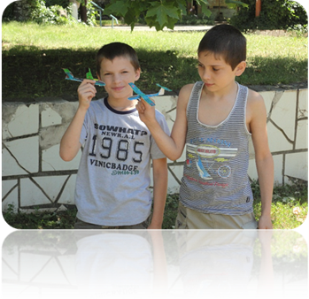
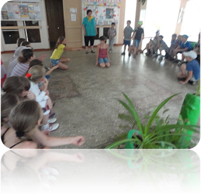
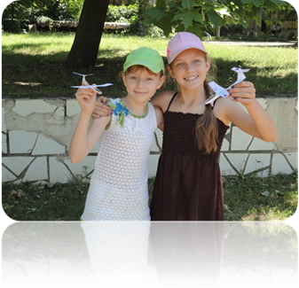
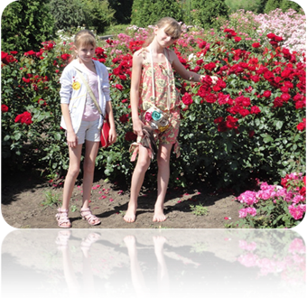

# Дитячий табір «Веселка» з денним перебуванням при КЗШ І – ІІІ ст. № 55 (з 02.06.2014 по 16.07.2014)

## Зоряний експрес

- Екскурсія «Зелена стежка».
- Пісенний колаж.
- Галявина цікавого.
- Гра «Веселі Робінзони».
- Конкурс малюнків «Малюю природу свого краю».

<Carousel id="_/72157646841579054" />

<Carousel id="_/72157649163151481" />

<Gallery>

</Gallery>

Нарешті ми дочекались відкриття пришкільного табору! Ура! На Галявині цікавого ми зустріли своїх однокласників і дуже гарно провели час. Кожен з нас зміг відчути себе авіаконструктором, садівником і навіть артистом.

<Gallery>

</Gallery>
