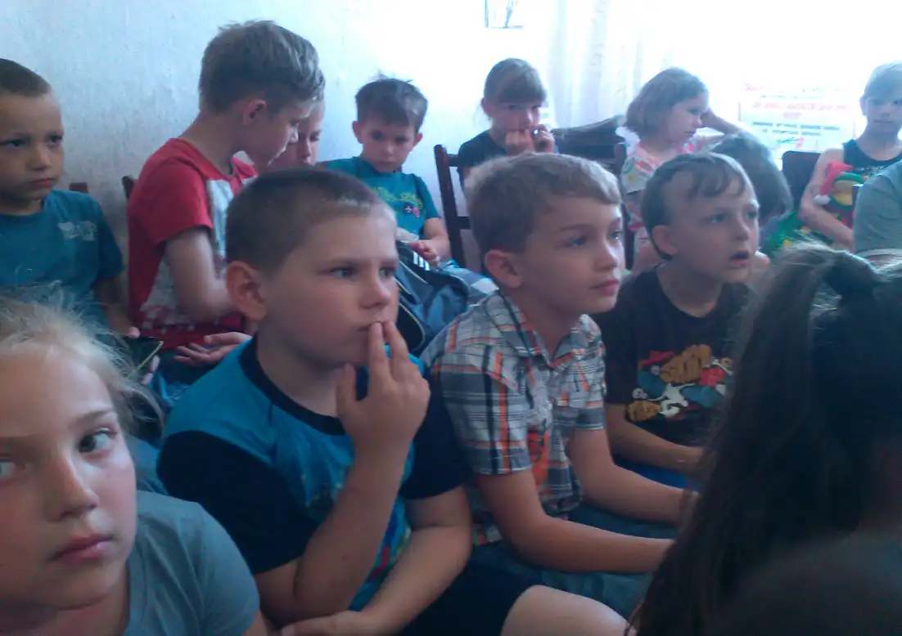
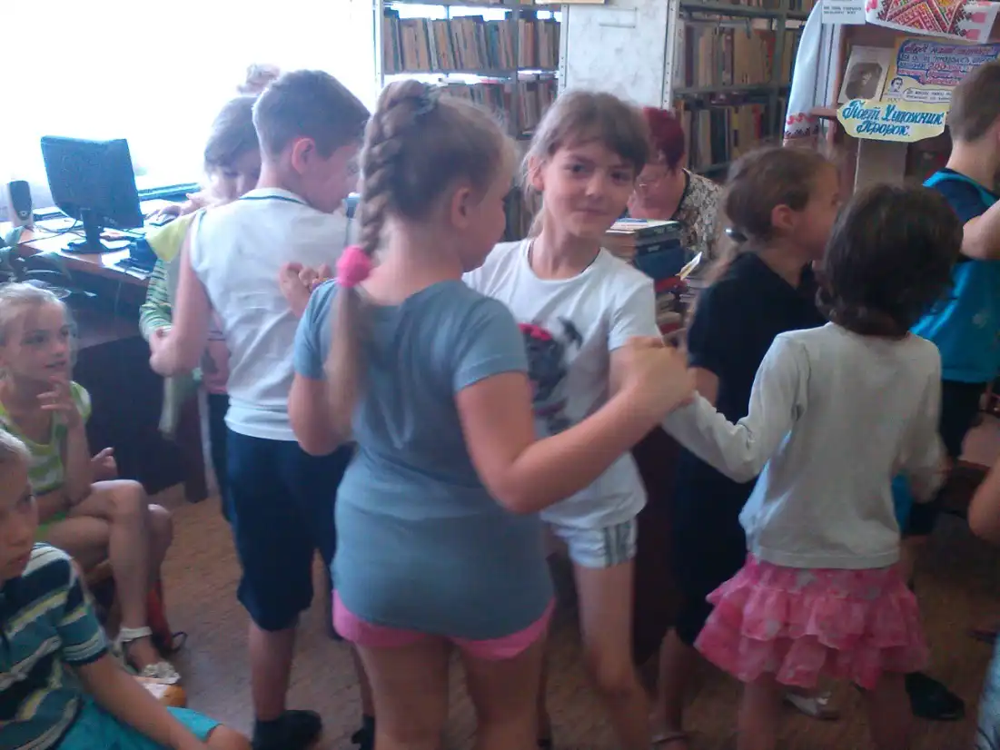
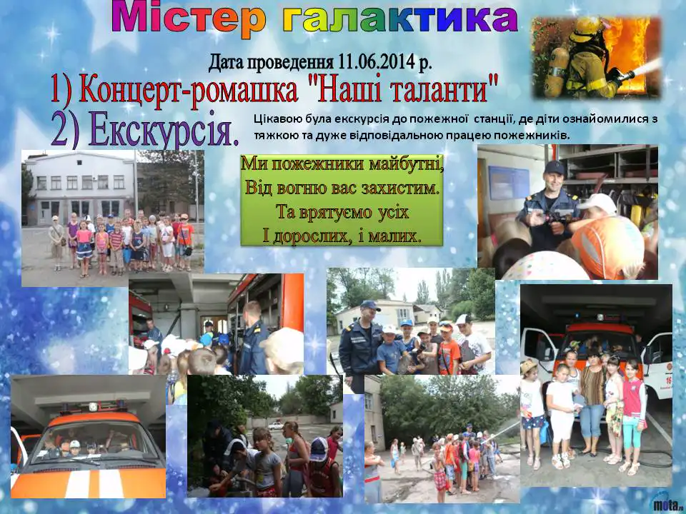
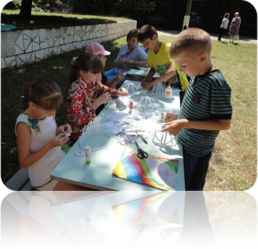
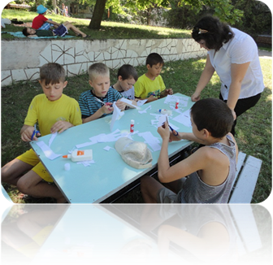
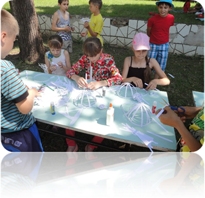
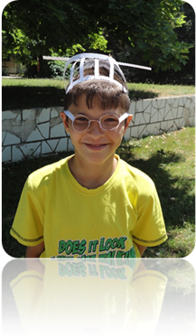

# Дитячий табір «Веселка» з денним перебуванням при КЗШ І – ІІІ ст. № 55 (з 02.06.2014 по 16.07.2014)

## Містер галактика 2014

- Концерт – ромашка «Наші таланти».
- Майстерня орігамі.
- Незвичайна дискотека.

<slideshow id="_/72157648764011470" />

<gallery>

</gallery>

Учні ІІ загону відвідали Тернівський СЮТ, де з ними провели майстер-клас роботи із глиною. Керівник гуртка “Кераміка” Ольга Михайлівна цікаво і доступно познайомила з технікою виконання глиняної іграшки. Діти із задоволенням та старанністю спробували самі виготовити власну ляльку, яку потім мали змогу залишити собі напам’ять.

<slideshow id="_/72157648756372067" />

Це стародавнє мистецтво з Японії захопило нас на цілий день. Дивно, але звичайний папір надає такі можливості: розповісти другові казку, одягнути подругу, прикрасити будинок.

<gallery>

</gallery>
