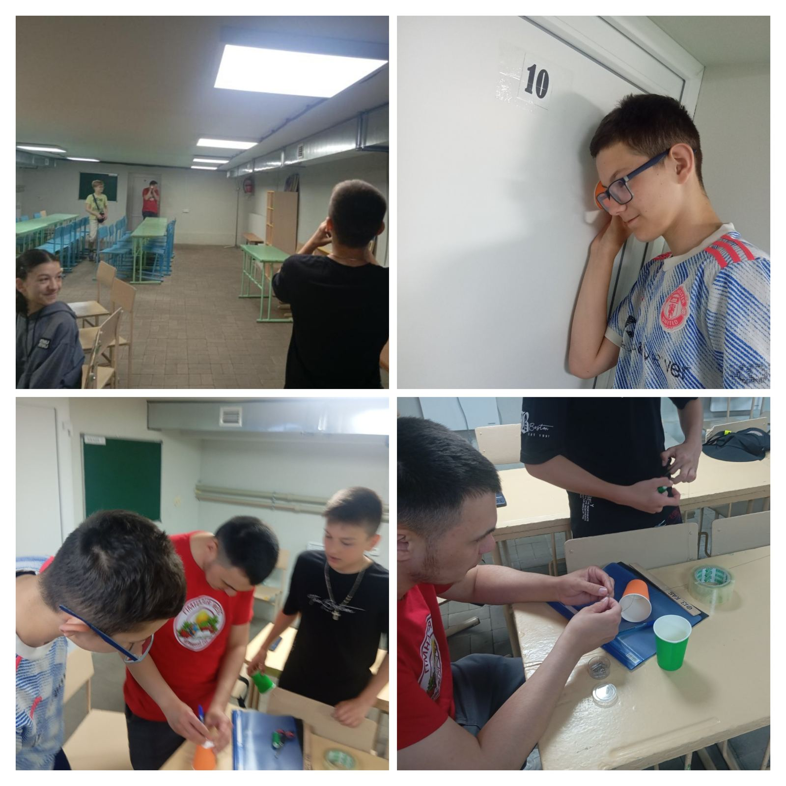
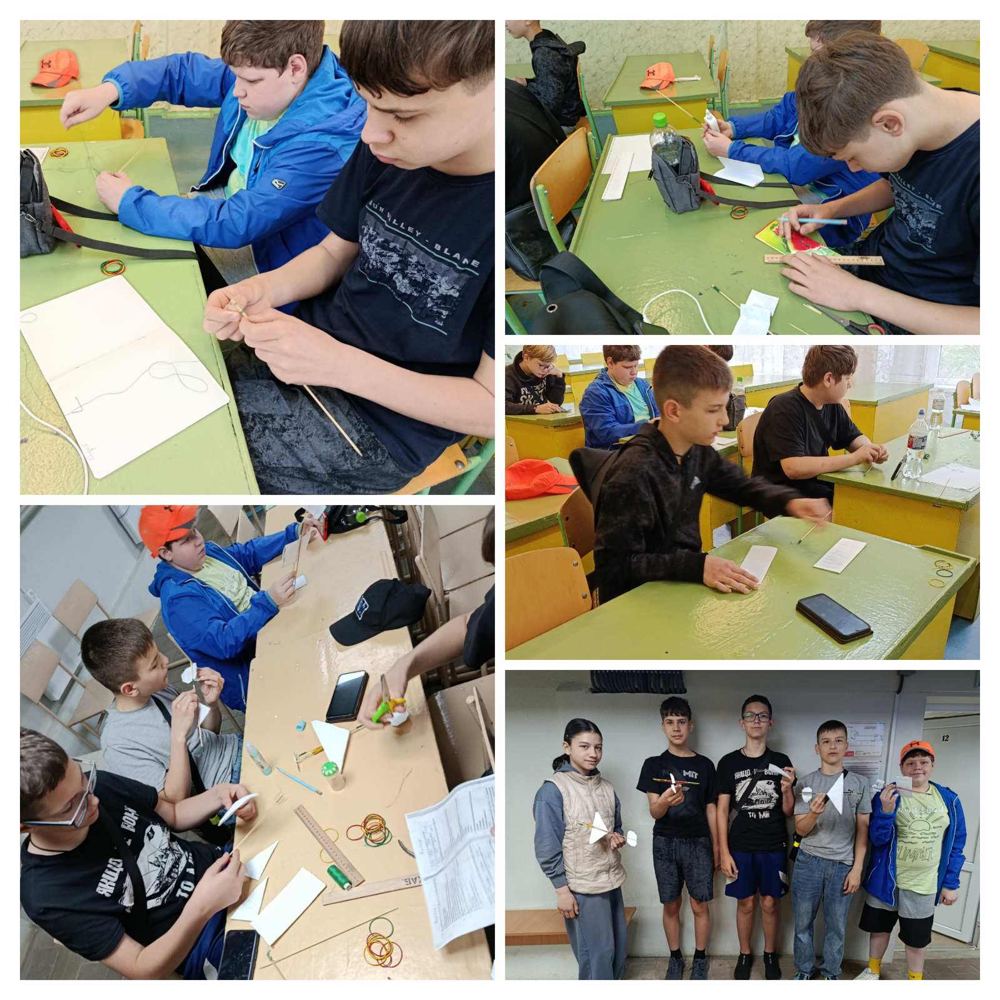

---
title: 🚀 Алло, ми шукаємо таланти! Або як пройшов день у майстерні «Юний винахідник»
---

Хто сказав, що фізика — це лише формули в підручнику? Сьогодні наші 7-класники перетворилися на справжнє конструкторське бюро! 🛠⚙️

Що ми встигли начудити та винайти:\
📞 «Айфон на мінімалках»: Сконструювали справжній акустичний телефон зі звичайних стаканчиків та нитки. Перевірено: зв'язок ловить ідеально навіть без Wi-Fi, а звук передається завдяки коливанням матеріалу!\
🛩 Покорителі повітря: Зібрали моделі літачків із гумомотором. Діти на практиці розібралися, як потенціальна енергія закрученої гумки перетворюється на шалену кінетичну енергію польоту.

Гортайте колаж, щоб побачити ці щирі емоції перших випробувань! Який винахід ви б протестували першим?

<Gallery>

</Gallery>