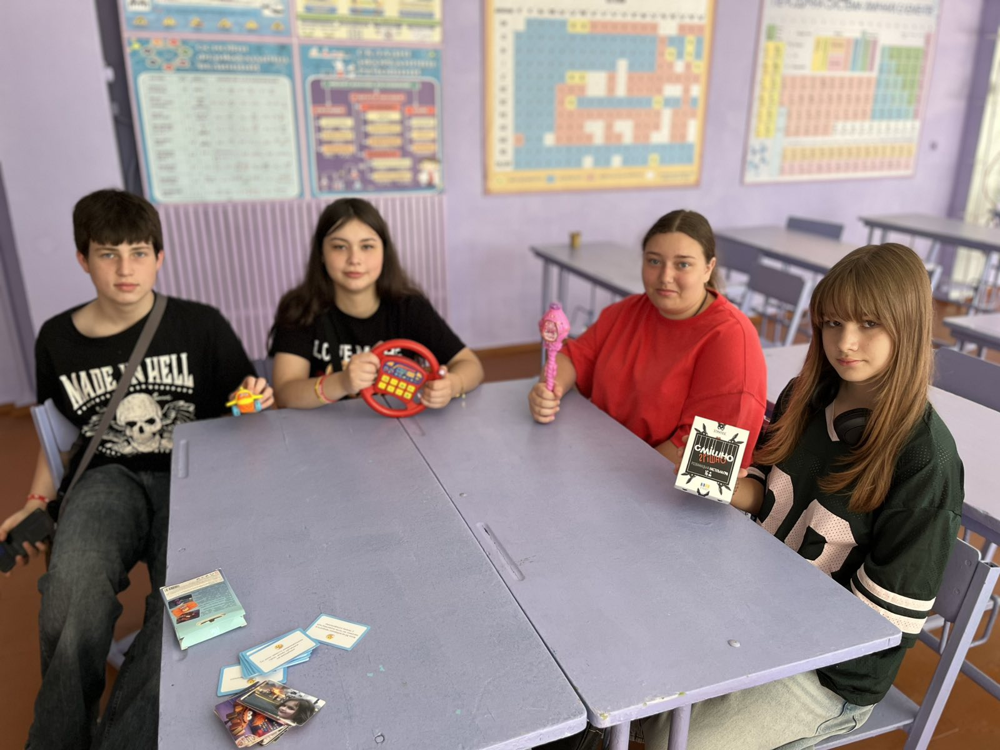

---
title: "🎁♻️ White Elephant: Trash Edition ♻️🎁"
---

Хто сказав, що непотрібні речі не можуть стати справжнім скарбом? 😄

Сьогодні на нашому літньому майданчику відбулася незвичайна англомовна гра «White Elephant: Trash Edition»! Діти обмінювалися кумедними «сюрпризами» зі звичайних побутових речей, вчилися описувати їх англійською, відгадувати призначення та переконувати інших, чому саме цей предмет вартий уваги.

Було багато сміху, несподіваних ідей та творчих рішень! А найголовніше — учасники зрозуміли, що навіть звичні речі можуть отримати друге життя, якщо додати трохи фантазії.

Англійська + креативність + екологічне мислення = чудовий день у таборі! 🌍💚

