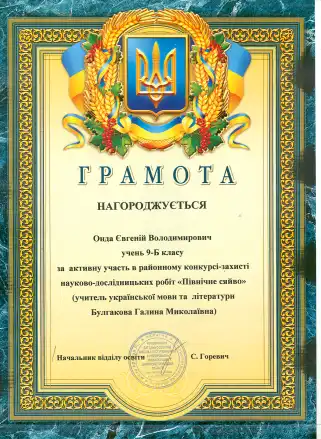
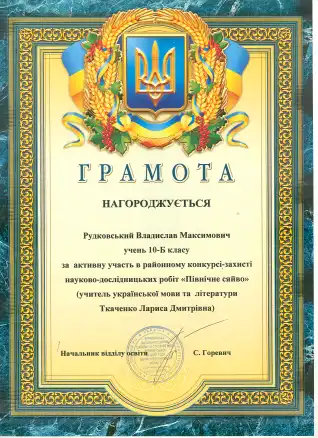
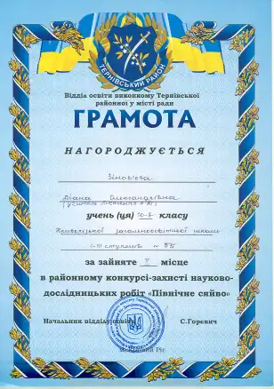
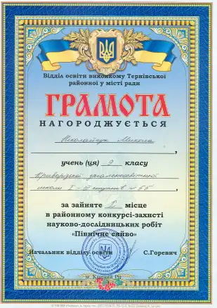
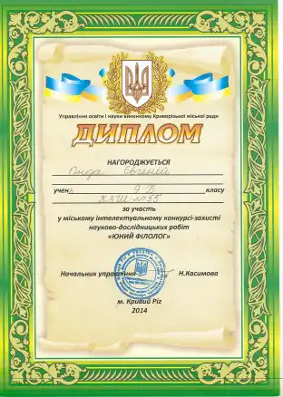
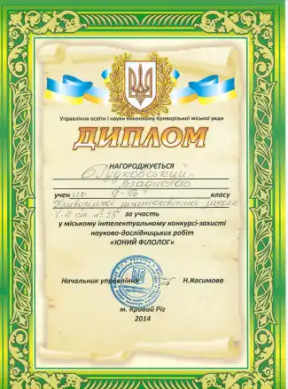
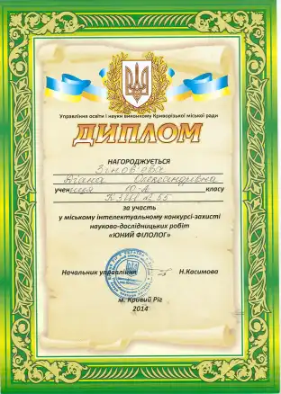
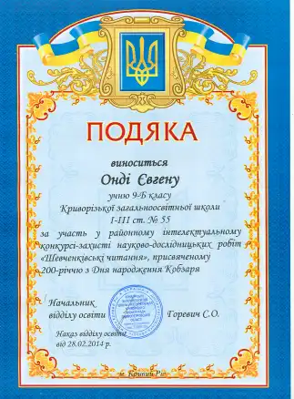
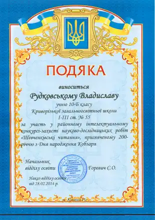
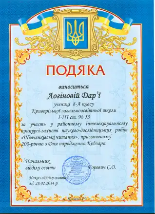

Готуючись до 200-річчя з Дня народження великого Кобзаря Т. Г. Шевченка учні 8-10 класів підготували науково-дослідницькі роботи і захистили їх на районних та міських конкурсах:

1.  Районний конкурс «Північне сяйво» (**грудень 2013р.**, КЗШ I-III ст. № 61):

    1.  «Тернистий шлях великого Кобзаря Т. Г. Шевченка» – учень 9-Б класу Онда Євгеній (учитель української мови та літератури Булгакова Галина Миколаївна).
    2.  «Роль жінки у житті та творчості великого Кобзаря – Тараса Григоровича Шевченка» – учень 10-Б класу – Рудковський Владислав. Учитель української мови та літератури Ткаченко Лариса Дмитрівна.
    3.  «Прозова творчість Тараса Григоровича Шевченка» – учениця 10-А класу – Зінов’єва Діана (учитель української мови та літератури Ткаченко Лариса Дмитрівна).
    4.  «Власна поезія Т. Г. Шевченка» – учень 9-Б класу Ніколайчук Микола (учитель української мови та літератури Булгакова Галина Миколаївна).

Учні були нагороджені грамотами за участь та перемогу в конкурсах

<gallery>

</gallery>

2.  Міський інтелектуальний конкурс науково-дослідницьких робіт «Юний фіолог» (**січень 2014р.**, КЗШ I-III ст. № 118):

    1.  «Тернистий шлях великого Кобзаря Т. Г. Шевченка» – учень 9-Б класу Онда Євгеній (учитель української мови та літератури Булгакова Галина Миколаївна).
    2.  «Роль жінки у житті та творчості великого Кобзаря – Тараса Григоровича Шевченка» – учень 10-Б класу – Рудковський Владислав. Учитель української мови та літератури Ткаченко Лариса Дмитрівна.
    3.  «Прозова творчість Тараса Григоровича Шевченка» – учениця 10-А класу – Зінов’єва Діана (учитель української мови та літератури Ткаченко Лариса Дмитрівна).

Учні були нагороджені грамотами за участь та перемогу в конкурсах

<gallery>

</gallery>

3.  Районний конкурс науково-дослідницьких робіт до 200-річчя з Дня народження Т. Г. Шевченка (**лютий 2014р.**, КЗШ I-III ст. № 116):

    1.  «Тернистий шлях великого Кобзаря Т. Г. Шевченка» – учень 9-Б класу Онда Євгеній (учитель української мови та літератури Булгакова Галина Миколаївна).
    2.  «Роль жінки у житті та творчості великого Кобзаря – Тараса Григоровича Шевченка» – учень 10-Б класу – Рудковський Владислав. Учитель української мови та літератури Ткаченко Лариса Дмитрівна.
    3.  «Тернистий шлях Великого Кобзаря – Тараса Григоровича Шевченка» – учениця 8-А класу – Логінова Дар’я Сергіївна. Учитель української мови та літератури Ткаченко Лариса Дмитрівна.

Учні були нагороджені грамотами за участь та перемогу в конкурсах

<gallery>

</gallery>
