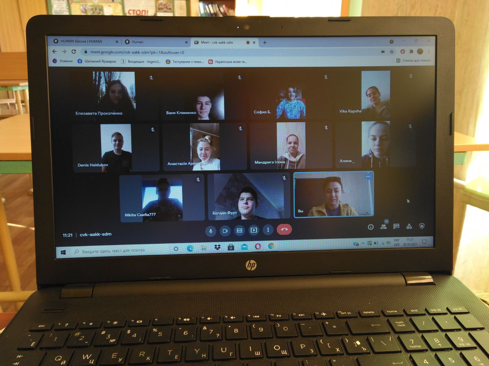

---
title: "Тиждень «Медіаосвіти та медіаграмотності». Тематичний день: «Протидія дезінфодемії - медійна та інформаційна грамотність кожного і для всіх»"
---

Уперше святкування глобального тижня медійної та інформаційної грамотності відбулося восени 2012 року за ініціативою ЮНЕСКО та з допомогою Альянсу цивілізацій ООН, Міжнародної університетської мережі з медійної та інформаційної грамотності й міжкультурного діалогу.

Згідно з задумкою організаторів, Всесвітній тиждень медійної та інформаційної грамотності має об’єднати активістів із різних країн, які вважають медійну та інформаційну грамотність дієвим способом активізації міжкультурного діалогу.

Медійна та інформаційна грамотність, за концепцією ЮНЕСКО, об’єднує три взаємопов’язані комплекси компетенцій:

- **інформаційну грамотність** – вміння знаходити, аналізувати, використовувати інформацію;
- **медіаграмотність** – вміння отримувати доступ до медіа, а також створювати контент для самовираження та спілкування;
- **технологічну/цифрову грамотність** – передбачає вміння користуватись сучасними інформаційними технологіями та програмним забезпеченням з урахуванням усіх можливостей.

Сьогодні ми живемо у світі з різким збільшенням доступу до інформації та онлайн спілкування. Інтернет, без сумнівів, став ядром інформації. Серед шаленого потоку інформації людям може бути важко визначити, що таке достовірна інформація, а іноді й незрозуміло, як варто на неї реагувати, ділитися та коментувати. Це все ускладнюється кризою COVID-19, коли дезінформація та фейки сміливо розгулюють Мережею.

Найактивнішою, але досить вразливою групою серед користувачів Інтернету є молоді люди. Молодь є основним користувачем інформації та генератором нових комунікаційних технологій. І сьогодні дуже важливо підтримати нові покоління для ефективного та медіаграмотного використання потоків інформації.

ЮНЕСКО закликає заохочувати молодь усвідомлено відноситися до інформації, аналізувати її перед тим, як споживати чи поширювати.

Для підвищення інформаційної грамотності радять молодіжних організаціям організовувати короткі вебінари та дискусії / дебати в рамках своїх молодіжних мереж. Заохочувати молодь до ведення блогів про медіа та інформаційну грамотність та міжкультурний діалог.

Глобальна пандемія, яка зараз триває, спонукає суспільство активніше застосовувати цифрові технології в повсякденному житті та на роботі, підтверджує важливість медійної та інформаційної грамотності в епоху цифрових технологій.

У світі постправди та жорстких реалій українського інформаційного простору медіаграмотність для кожної людини – це справді необхідний інструмент для захисті від дезінформації та фейків.

Так, 01.11.2021 в КЗШ І–ІІІ ст.№ 55 Добровольською В.Е., класним керівником 9–Б класу, було проведено онлайн урок про протидію дезінфодемії, де були висвітлені питання щодо медійної та інформаційної грамотності кожного.

