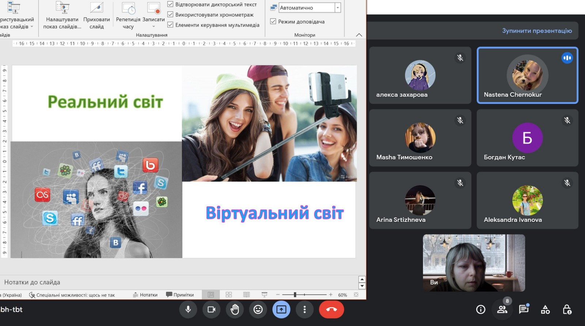

---
title: Диспут «Реальний чи віртуальний?»
---

В якому світі комфортніше почуває себе сучасна молодь? Чому підліткам важко визначитись із цим питанням? В чому так програє реальність перед уявним життям? Такі питання дійсно хвилюють учнів 9-Б класу - і це говорить про потребу змін, про важливість критичного мислення і високої самоефективності. Але після проведеного диспуту «Реальний чи віртуальний?» також стала міцнішою надія на втілення тих змін саме цим ще незіпсованим поколінням і змін у першу чергу в їхній свідомості.

