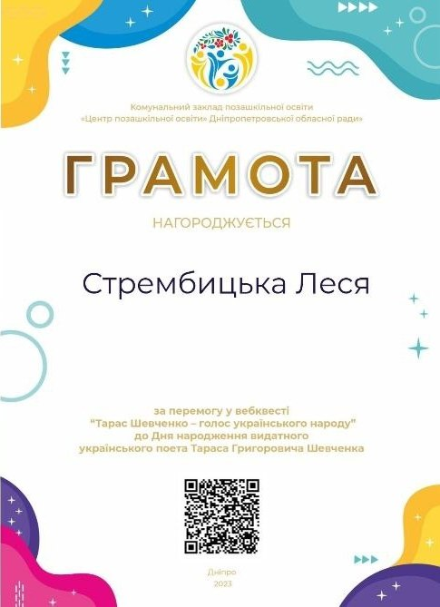
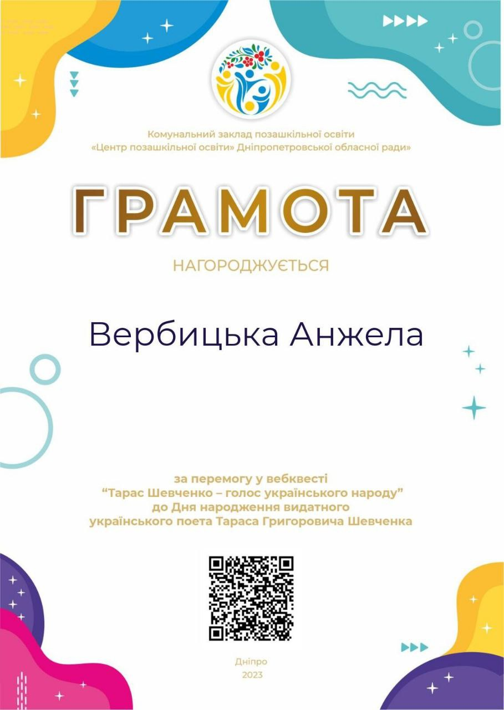
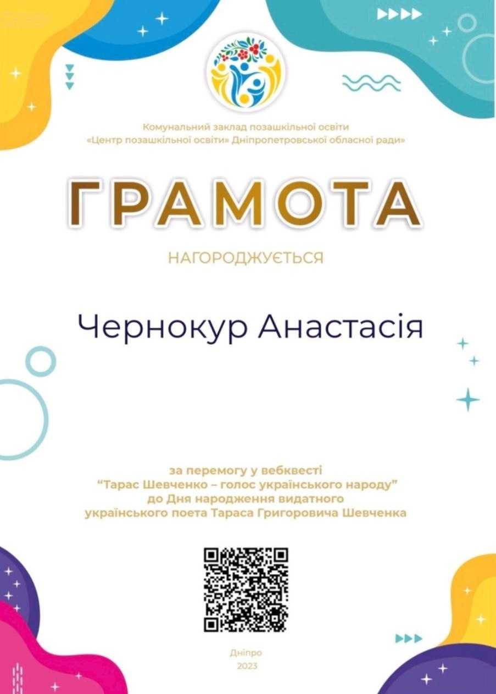
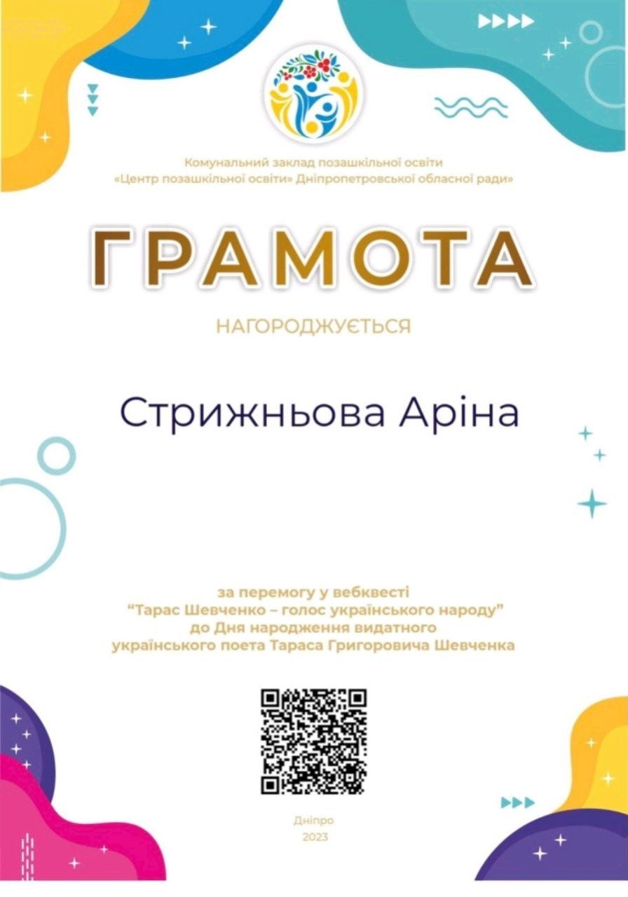

---
title: Конкурс читців віршів Шевченка серед учнів 6 і 9 класів
---

З метою популяризації творчої спадщини Кобзаря, вже традиційно на початку березня в гімназії готують низку заходів до Дня народження Тараса Шевченка. І щоразу це випробування на креативність та учнівський інтерес. Учителем української мови та літератури Стрембицькою Л.А. було проведено конкурс читців віршів Шевченка серед учнів 6 і 9 класів; «Шевченкознавчу вікторину» — для дев'ятикласників; віртуальну екскурсію «Пам’ятники Шевченку у світі». Учні взяли участь у вебквесті «Тарас Шевченко - голос українського народу».

Творчість Т. Г. Шевченка — це святиня, якою дорожить і пишається український народ.

<slideshow />

<youtube id="ThsKYBHOk1A" />

<youtube id="8sGSc_EDYg0" />

<youtube id="RUv2D2uNhnI" />

<gallery>

</gallery>
