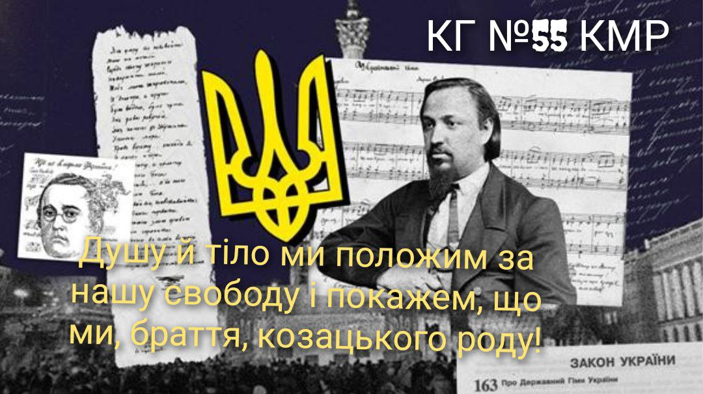

---
title: День Державного Гімну України
---

10 березня — День Державного Гімну України, одного з головних символів держави поряд із прапором і гербом. Цього дня у 1865 році в польському місті Перемишль уперше пролунав твір композитора Михайла Вербицького на слова поета Павла Чубинського «Ще не вмерла Україна».

Нині гімн України звучить по всьому світу, у різному виконанні, починаючи від маленьких діток до воїнів, що захищають нашу рідну країну від російських окупантів. Він надихає нас на боротьбу за свободу та незалежність, надає сили, віри та надії на щасливе майбутнє України.

Давайте покажемо усім, що нас, українців, об’єднує одна мета – МИР, ПЕРЕМОГА, любов до країни та життя у вільній соборній державі.

