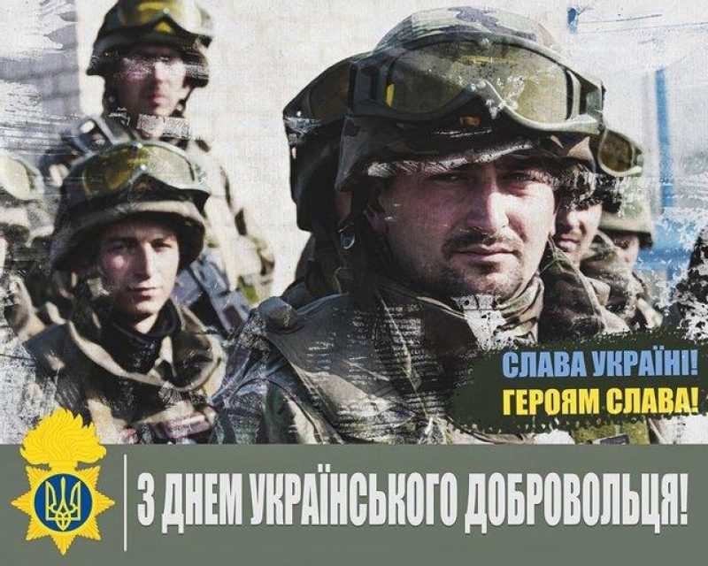

---
title: День українського добровольця
---

Щороку 14 березня в Україні відзначається День українського добровольця. Пам'ятна дата встановлена Верховною Радою України у 2017 році, щоб вшанувати мужність та героїзм захисників незалежності, суверенітету й територіальної цілісності нашої держави.

Україна нині переживає найбільше випробування у своїй новітній історії – збройну боротьбу з російським агресором за власну незалежність і територіальну цілісність.

Наші мужні оборонці, які сьогодні гідно дають відсіч ворогові, стоять в одному ряду з цілими поколіннями борців за волю і державну самостійність.

Завжди, у найважчі часи нашої історії, знаходилися відважні, які добровільно брали зброю до рук і ставали на захист своєї Батьківщини.

Нині добровольцем став увесь Український народ: ті, хто прийшов до центрів комплектування та поповнив ряди Збройних Сил України; ті, хто став до лав територіальної оборони; ті, хто всіляко допомагає захисникам і готовий стати до їхніх лав завтра.

Наша готовність добровільно стати на захист України є вирішальною запорукою нашої перемоги. Українські добровольці – це символ звитяги, самопожертви та героїзму.

Наближаємо перемогу разом! Ми все зможемо й здолаємо ворога! Слава Україні! Героям Слава!

