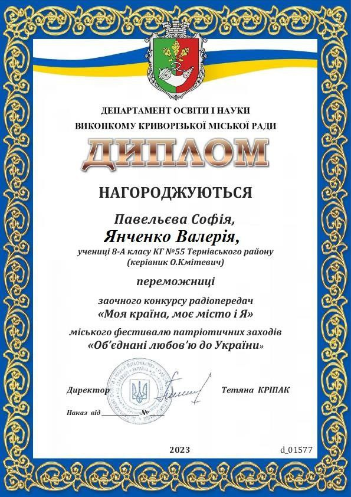

---
title: Перемога у міському фестивалі патріотичних заходів «Об’єднані любов’ю до України» заочного конкурсу радіопередач «Моя країна, моє місто і Я»
---

Творча група креативних учнів 8-А класу КГ №55 КМР: Павельєва Софія, Янченко Валерія, Петрусь Віктор, Лутков Андрій, Буряк Катерина, Пересунько Дар’я під керівництвом талановитого учителя Кмітевича О. В. здобула перемогу до скарбнички нашої гімназії! Участь у міському фестивалі патріотичних заходів «Об’єднані любов’ю до України» заочного конкурсу радіопередач «Моя країна, моє місто і Я» принесла високий результат.

Вітаємо переможців і бажаємо не зупинятися на досягнутому успіху!

