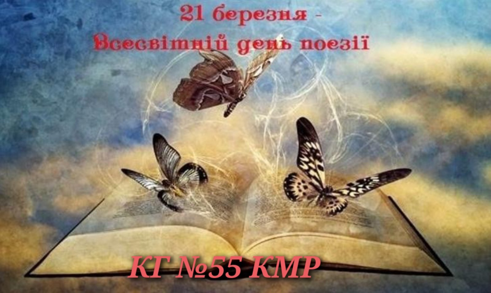

Всесвітній день поезії — свято, яке відзначається щороку 21 березня.

Поезія — це не просто віршовані слова, це форма вираження почуттів. У душі кожної людини живе її внутрішній романтик. Саме цим зумовлений той факт, що поезія — завжди неповторність.

Вона допомагає побачити прекрасні й незвичайні сторони в повсякденних речах, у тому простому житті, яке оточує нас щодня. Поезія червоною ниткою проходить через все життя людини, роблячи його більш яскравим та насиченим.

