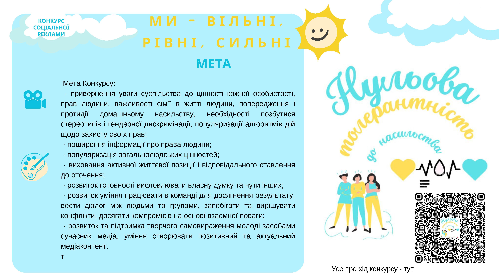

---
title: Участь у конкурсі «Нульова толерантність до насильства»
---

Робота подана на конкурс «Нульова толерантність до насильства», який проводиться у Криворізькій (Новопільській громаді) у межах співпраці UNFPA та ГО «Інноваційні соціальні рішення» за підтримки Бюро гуманітарної допомоги USAID.

Учасники: Горіла Маргарита, Леончикова Поліна, Мітькова Катерина, Оголь Аріна, Жуковська Віолетта, Константінова Яна, Ліцвер Мілана, Касян Юрій.

Керівник: Рочева Анна Андріївна.

<youtube id="6I4vIS1B6TM" />
