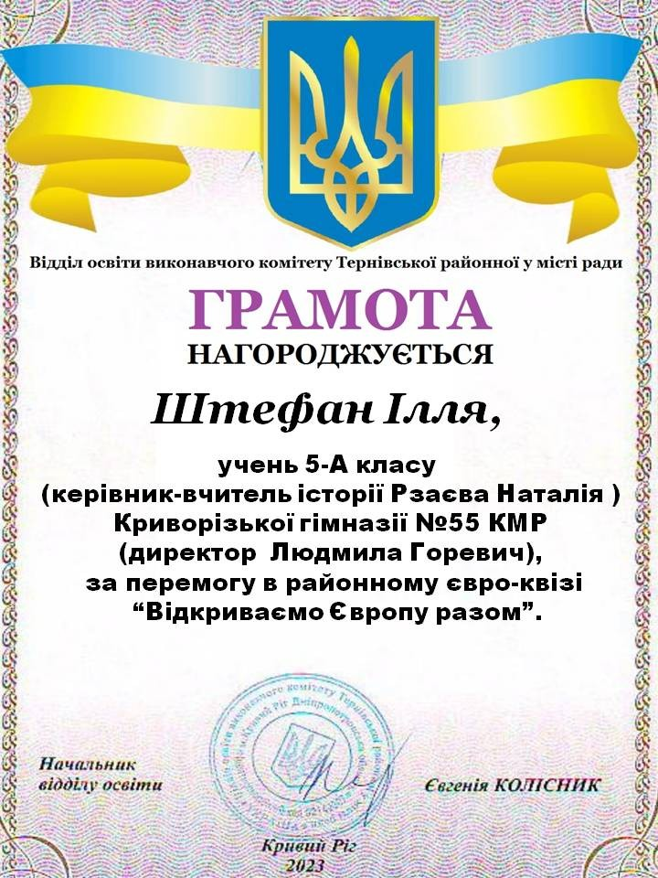
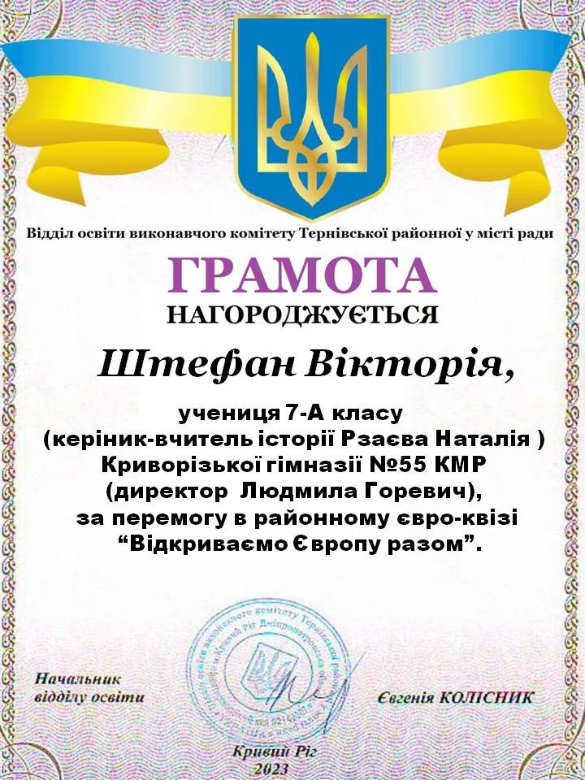

Криворізька гімназія №55 вітає Штефана Іллю, учня 5-А класу, і Штефан Вікторію, ученицю 7-А класу, та керівника, учителя історії Рзаєву Наталію Олександрівну, за перемогу в районному євро-квізі «Відкриваємо Європу разом».

Бажаємо старанно й гідно йти до вершин своїх успіхів!

