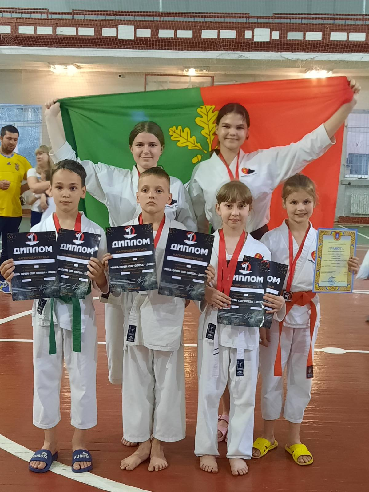

---
title: Чемпіонат з традиційного карате-до
---

27 травня в м. Одеса пройшов чемпіонат з традиційного карате-до. Під керівництвом тренера Осікова Павла Володимировича вихованці, які тренуються на базі Криворізької гімназії №55, посіли призові місця: Карєєва Мар’яна здобула два золота, Літава Мілана - І та ІІ місця, Дмитро Радовський -два перших місця, Шевяков Егор виборов два перших місця, Лісунова Анастасія - ІІІ місце, Тішуніна Анастасія- І та ІІІ місце , Ратушний Влад - два срібла, Зарудняк Анна здобула золото та срібло.

Вітаємо молодих спортсменів з перемогою. Бажаємо в подальшому успіху та звершень!

