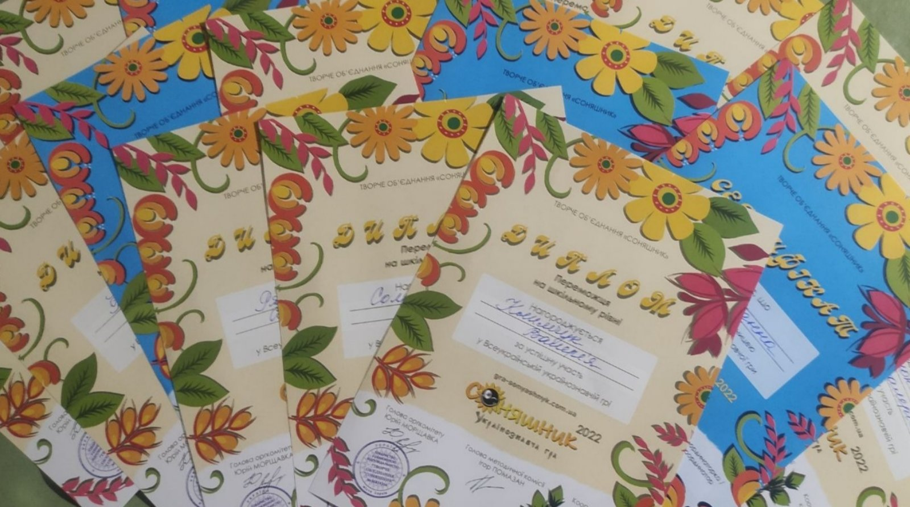

---
title: Всеукраїнська українознавча гра "Соняшник"
---

Світлоголові "соняшники" Криворізької гімназії №55! Отримані дипломи та сертифікати за участь учнів у Всеукраїнській українознавчій грі "Соняшник" показують зацікавленість українською мовою, літературою та українознавством.

