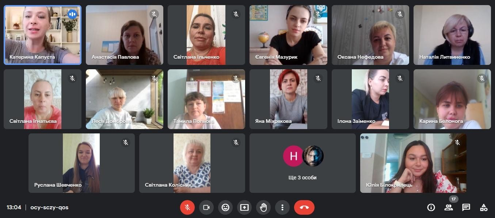

---
title: Онлайн засідання професійної спільноти педагогів-організаторів Тернівського району «Педагогічний Start-Hub»
---

20.09.2023р. педагог-організатор КГ №55 КМР взяла участь у онлайн засіданні професійної спільноти педагогів-організаторів Тернівського району «Педагогічний Start-Hub».

Обговорили завершення минулого навчального року та створили перспективну карту роботи професійної спільноти педагогів-організаторів, шкільних дитячо-юнацьких громадських об’єднань та районної спілки дитячих об’єднань "Терноцвіт" на І півріччя начального року 2023-2024.

Організовуємо свою роботу та роботу учнівського самоврядування так, щоб бути максимально корисними у житті свого закладу, міста та країни.

