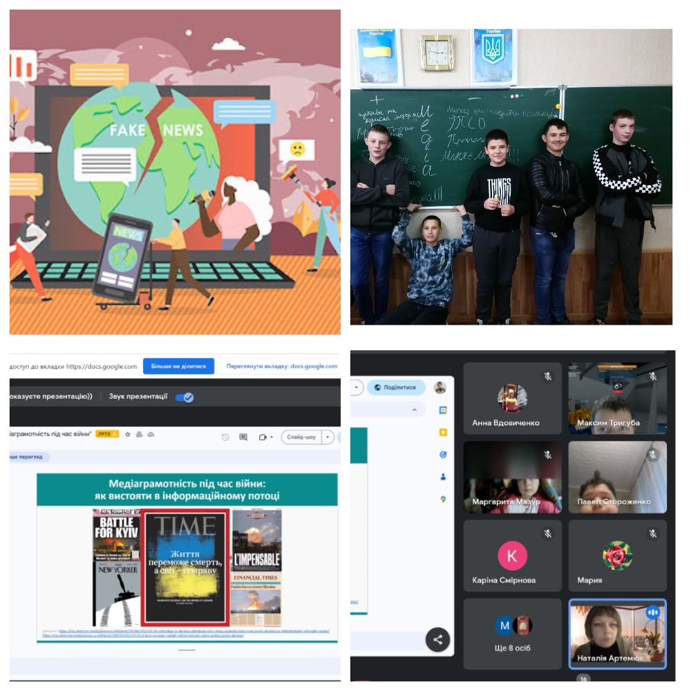

---
title: Тиждень медіаграмотності
---

У КГ №55 КМР у рамках тематичних днів міського проєкту «Медіаосвіта та медіаграмотность» із 30.10 по 03.11 пройшов Тиждень медіаграмотності. Учителі інформатики та здобувачі освіти були активними учасниками: Кмітевич О. В. із 5-А та 5-Б пройшли вебквест, педагогом проведено хвилинки спілкування, присвячені питанням медіаграмотності. Родіна А.О. для учнів 3-х класів організувала інтерактивний захід "Ховайтеся фейки світу"; Артемюк Н.А. із учнями 6-А класу опрацювала алгоритм дій "Медіаграмотність під час війни" та з 8-Б класом - урок "Медіаграмотність на часі".

