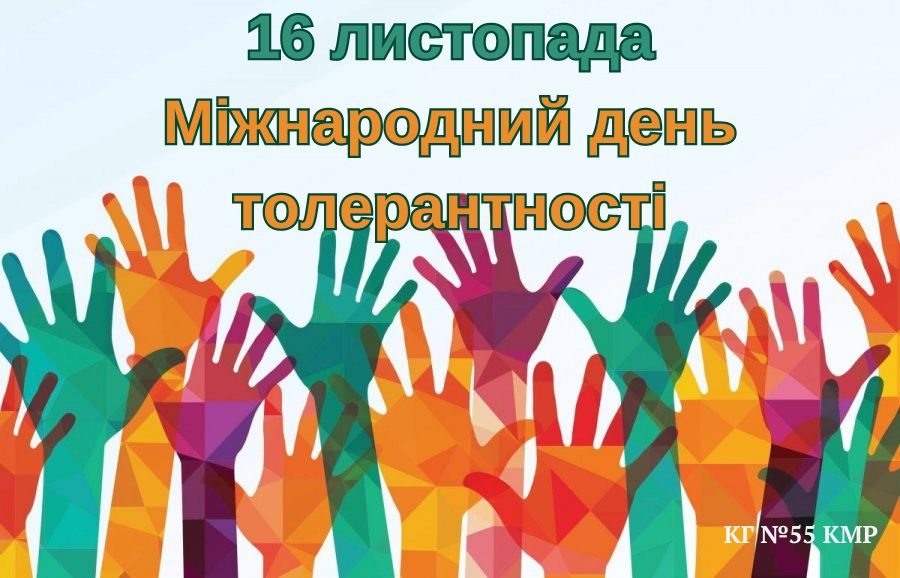
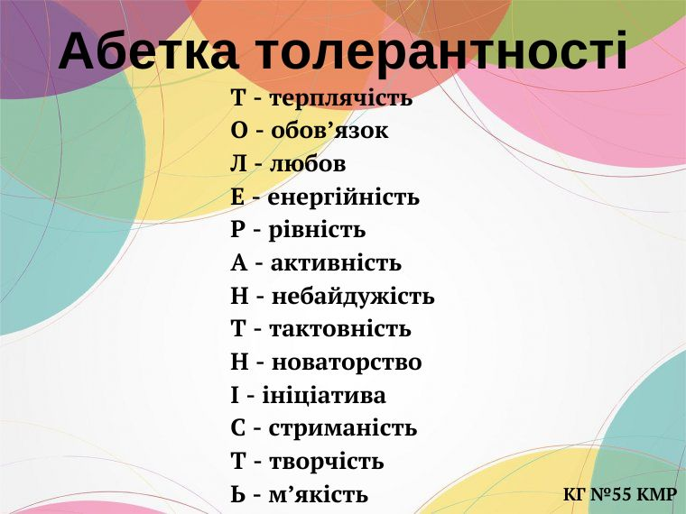

---
title: Виховна година «Без лихих слів»
---

У рамках проведення міської просвітницької промоакції «#ПравоНаЖиття» 16.11.2023 із учнями КГ №55 КМР було проведено виховну годину «Без лихих слів», адже запорука толерантної спільноти – відкритість, вміння спілкуватися та самовиявлятися, поважати один одного та приймати думки інших.

Сьогодні толерантність – яскравий показник ступеню демократичності кожної держави й одна з умов її розвитку.

