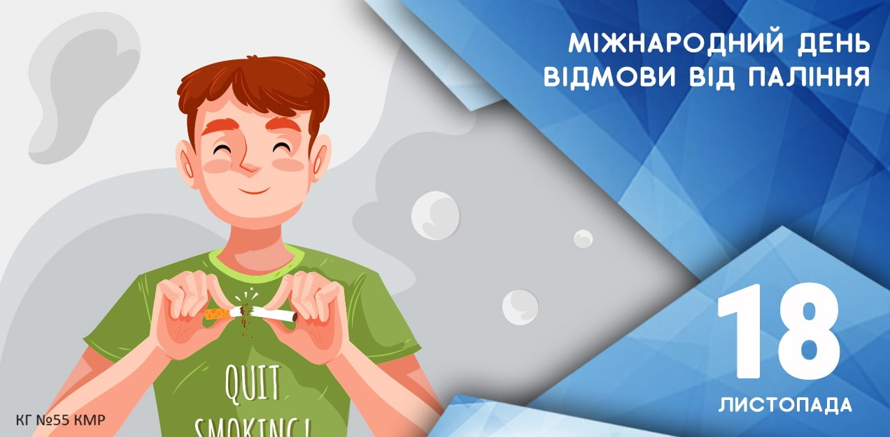
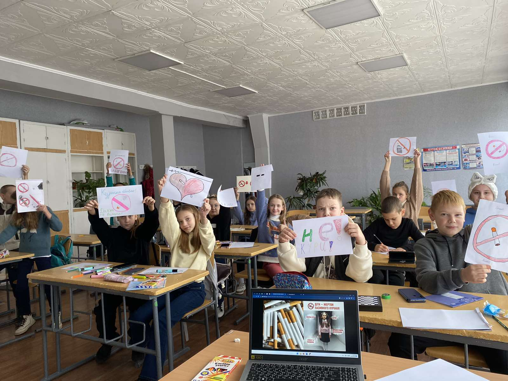

У рамках проведення міської просвітницької промоакції «#ПравоНаЖиття» напередодні Міжнародного дня відмови від паління (18.11.2023) із учнями КГ №55 КМР було проведено виховну бесіду "Молодь проти паління!», метою якої було залучання дітей до здорового способу життя та нагадування про небезпеку шкідливих звичок.

Проблема вживання тютюну нині особливо актуальна в українському суспільстві. Паління є провідним чинником розвитку багатьох хронічних захворювань, викликає залежність, не менш ризикованим для здоров’я є пасивне паління. Але в суспільстві є й позитивні тенденції: 62,5% курців хочуть позбутися залежності, а близько 40 % наразі намагаються кинути курити.

Дбайте про захист свого бездимного середовища та турбуйтеся про здоров’я людей навколо, адже наша держава нині, як ніколи, потребує здорових українців.

