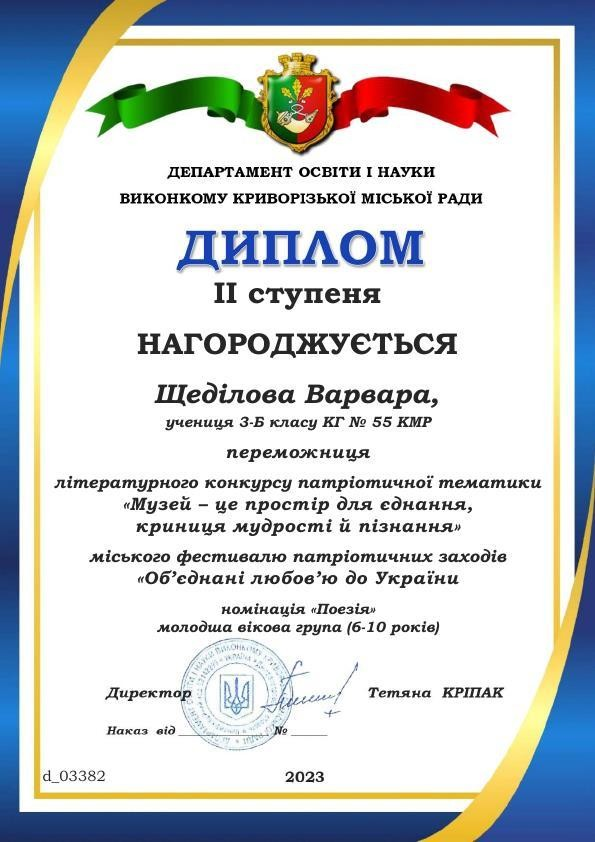

---
title: Перемога в міському літературному конкурсі патріотичної тематики «Музей – це простір для єднання, криниця мудрості й пізнання»
---

Вітаємо переможниць КГ №55 КМР: Щеділову Варвару, ученицю 3-Б класу (керівник Старікова Н.А.) - диплом ІІ ступеня; Таран Анну, ученицю 2-А класу (керівник Мугак Н.І.) - диплом ІІІ ступеня за перемогу в міському літературному конкурсі патріотичної тематики «Музей – це простір для єднання, криниця мудрості й пізнання» серед здобувачів освіти закладу загальної середньої освіти в номінації "Поезія". Бажаємо подальших перемог!

