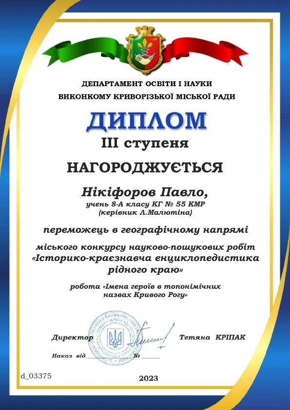

---
title: Перемога в міському конкурсі науково-пошукових робіт "Історико-краєзнавча енциклопедистика рідного краю"
---

Вітаємо Нікіфорова Павла, учня 8-А класу КГ №55 КМР, із перемогою в міському конкурсі науково-пошукових робіт "Історико-краєзнавча енциклопедистика рідного краю" (керівник Малютіна Л.М., учитель географії). Бажаємо подальших успіхів.

