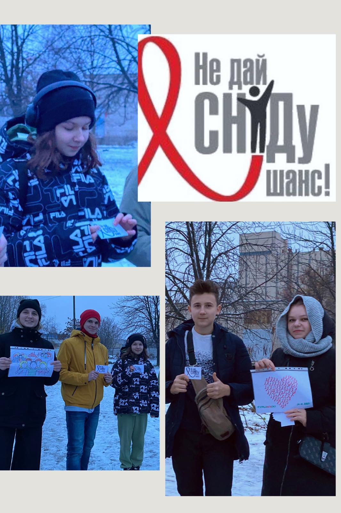
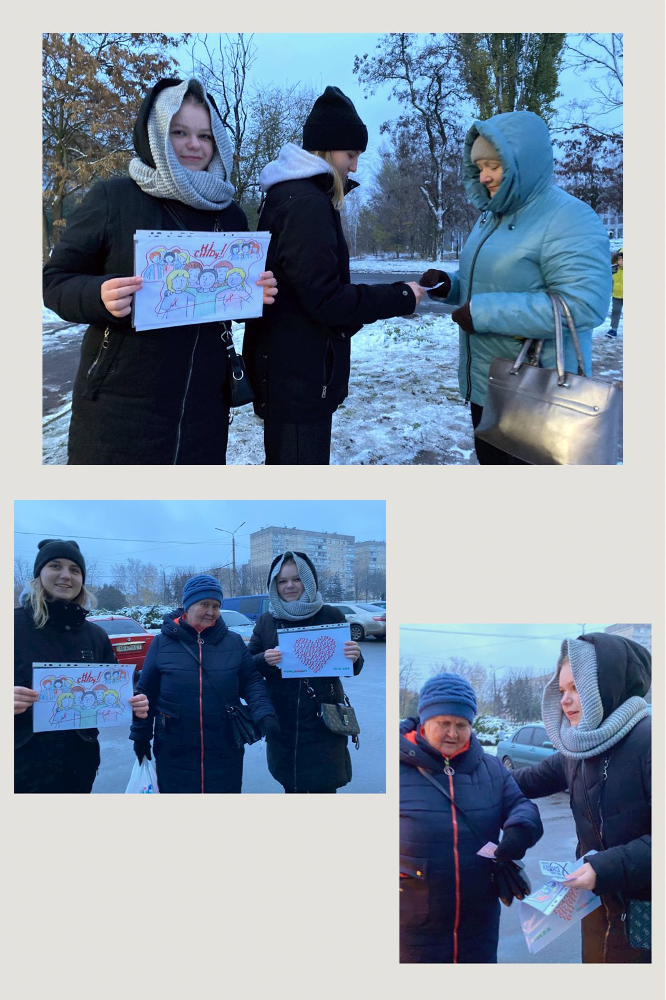

1 грудня світ відзначає день боротьби зі СНІДом та толерантності з ВІЛ-позитивними людьми. Людство звертає увагу на те, яку серйозну загрозу для життя несе ця глобальна проблема. Лідери учнівського самоврядування ДО "Первоцвіт" КГ №55 КМР долучилися до соціальної акції, що спрямована на інформування про небезпеку хвороби та шляхи її поширення.

