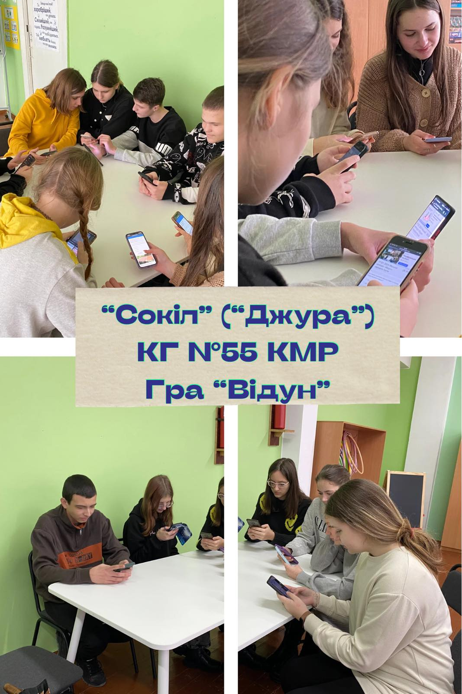

---
title: Конкурс «Відун»
---

«Сокіл» («Джура») - це про відданість рідній культурі, символ єднання, який возвеличує національну спадщину в серцях тих, хто бере участь. Саме тому учні та учениці КГ №55 КМР є активними учасниками гри. Завершився тиждень змагань із конкурсу «Відун». Зичимо всім гарних результатів!

