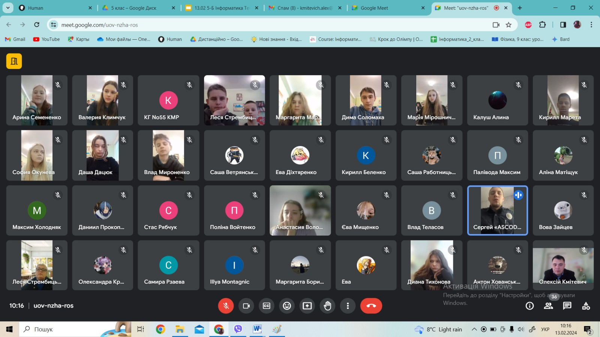

---
title: Бесіда «Безпека. Мережа Інтернет. Негативний вплив на дітей»
---

13.02.2024 у КГ №55 КМР Остроухом Сергієм Олеговичем, інспектором ВЗГ полку патрульної поліції, зі здобувачами освіти 7-А та 7-Б класів здійснено інформативну бесіду «Безпека. Мережа Інтернет. Негативний вплив на дітей». Учням пояснено наслідки від правопорушень.

