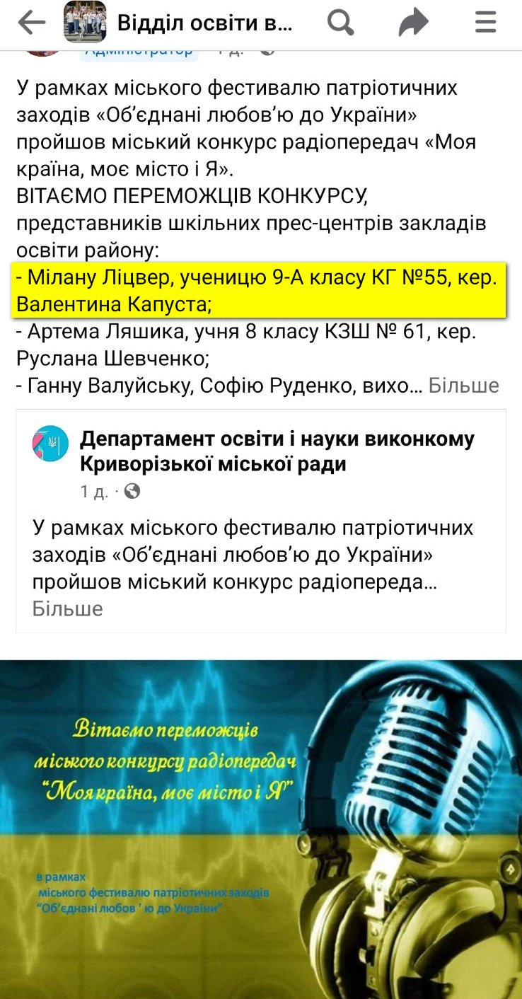

КГ №55 КМР вітає переможницю Міського конкурсу радіопередач «Моя країна, моє місто і Я», що пройшов у рамках міського фестивалю патріотичних заходів «Об’єднані любов’ю до України», представницю гімназійного прес-центру Мілану Ліцвер, ученицю 9-А класу ( творчий керівник Капуста В.М., класний керівник 9-А класу). Бажаємо підкорювати нові вершини творчості.

