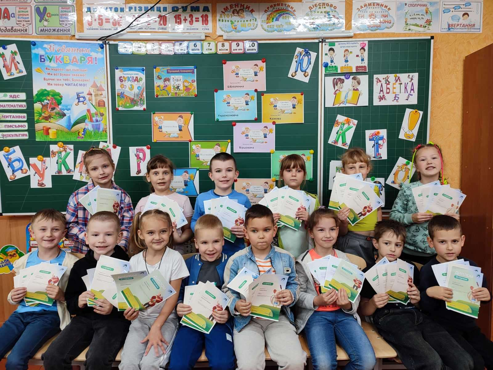
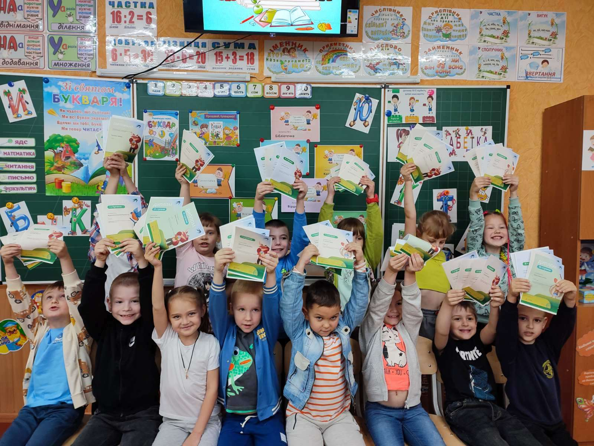

Учні 1-Б класу КГ №55 КМР - розумні, активні, талановиті, обдаровані, здібні діти. Щоб спробувати сили та проявити себе, взяли участь у Всеукраїнській інтернет-олімпіаді «На урок» з таких предметів: математика, українська мова та читання, Я досліджую світ та предметів початкової школи. І тепер хочемо поділитися з вами своїми досягненнями.

