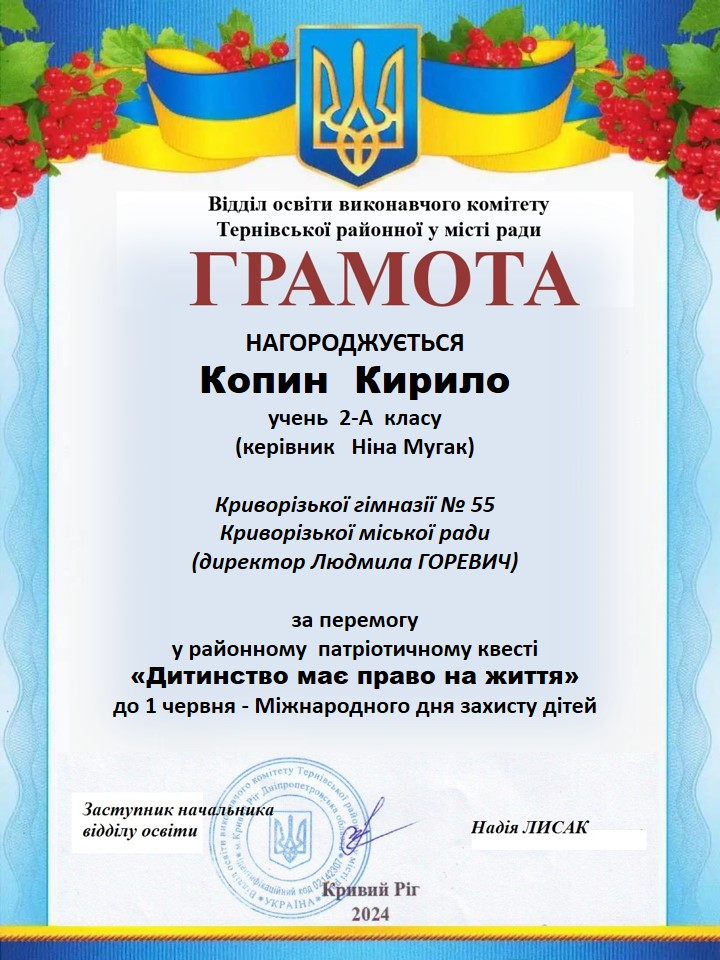

Вітаємо Копина Кирила, учня 2-А класу, із перемогою у районному патріотичному квесті «Дитинство має право на життя» до 1 червня – Міжнародного дня захисту дітей (керівник Мугак Н.І.). 

Бажаємо подальших успіхів і натхнення!

