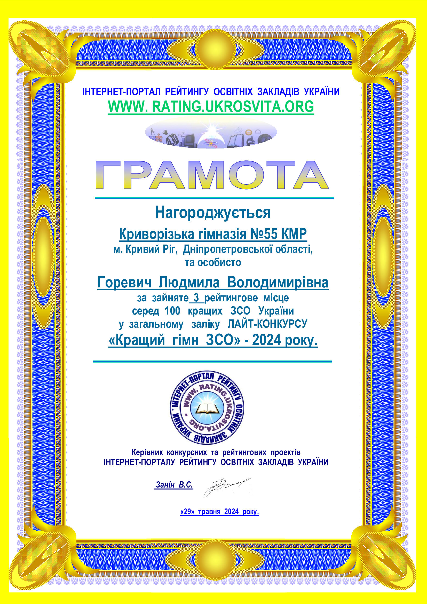

---
title: 3 місце у загальному заліку ЛАЙТ-КОНКУРСУ «Кращий гімн ЗСО» - 2024 року
---

Нагороджується грамотою Криворізька гімназія №55 КМР за зайняте 3 рейтингове місце серед 100 кращих закладів середньої освіти України у загальному заліку ЛАЙТ-КОНКУРСУ «Кращий гімн ЗСО» - 2024 року (музика: Рожук В.В., слова: Стрембицька Л.А. у співпраці з педагогічним колективом). Гімн гімназії – це символ нашого спільного шляху, наших мрій та досягнень. Співає гімназія – співає душа.

<youtube id="Ka5sqrpYHas" />
