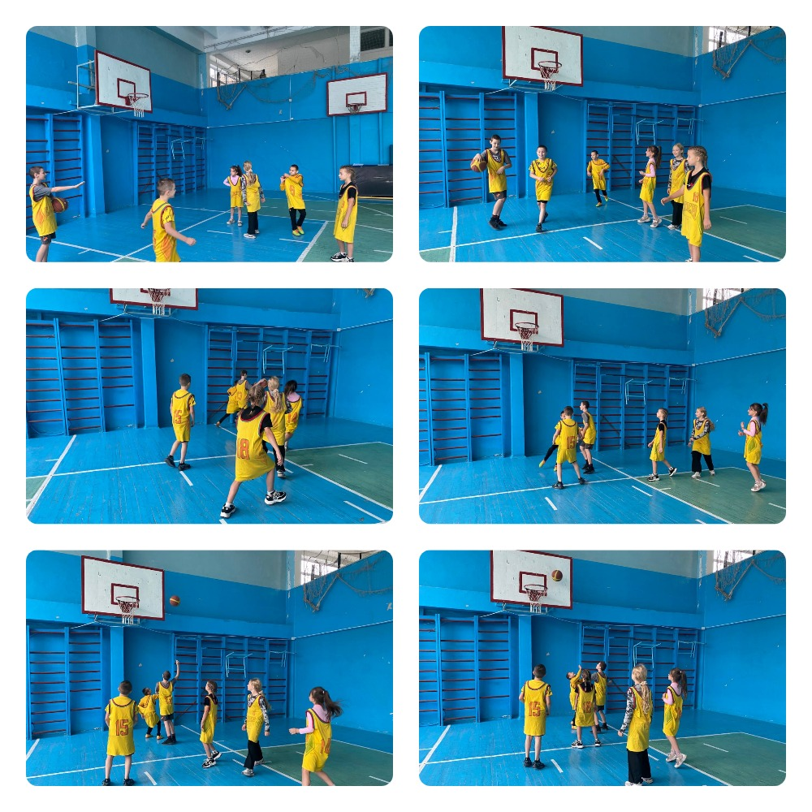
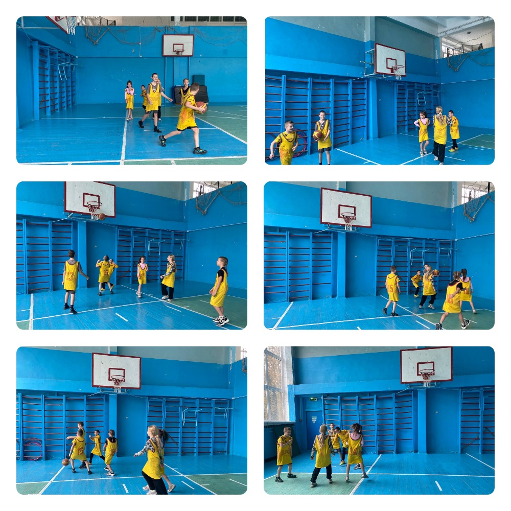

---
title: Стартували змагання проєкту «Пліч-о-пліч всеукраїнські шкільні ліги»
---

У КГ №55 КМР стартували змагання шкільного етапу проєкту «Пліч-о-пліч всеукраїнські шкільні ліги». Цей захід об'єднав учнів 5 класів, які показали свої спортивні таланти та командний дух. Змагання провів Лопатін Д.В., учитель фізичного виховання, із кількох дисциплін, серед яких футбол, волейбол та баскетбол.

