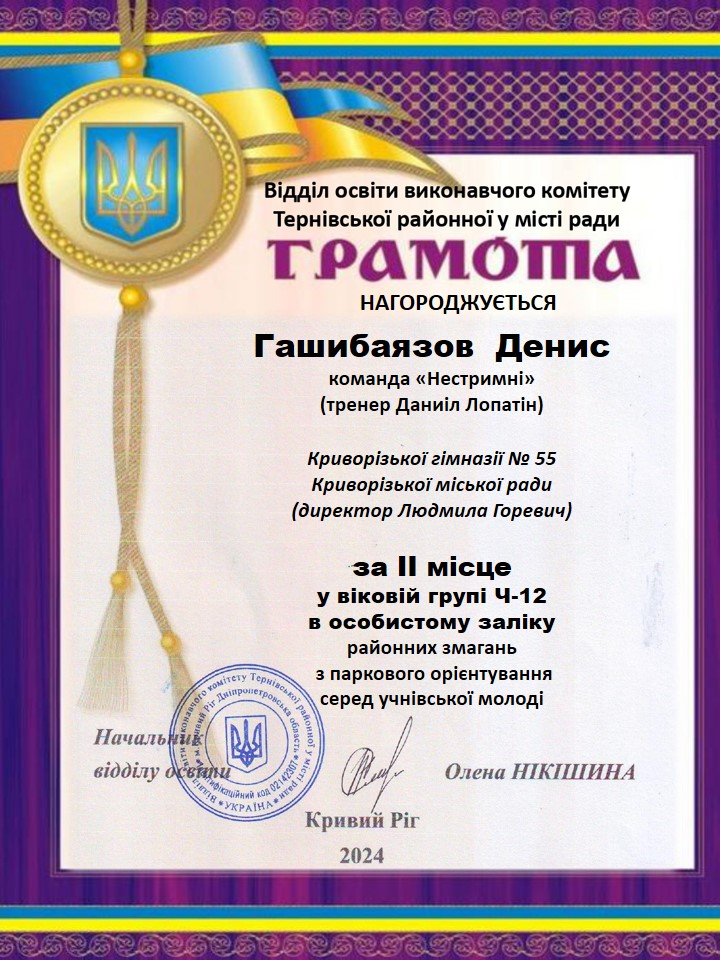

---
title: Переможці районних змагань з паркового орієнтування серед учнівської молоді
---

Це приємна новина! КГ №55 КМР щиро вітає переможців районних змагань з паркового орієнтування серед учнівської молоді, які здобули почесне II місце. Особливі вітання тренеру Даниілу Лопатіну та команді "Нестримні". Також ми вітаємо Гашибаязова Дениса, який зайняв II місце у віковій групі Ч-12 в особистому заліку. Ваші досягнення є чудовим прикладом наполегливості та командного духу! Бажаємо подальших успіхів і нових перемог!

