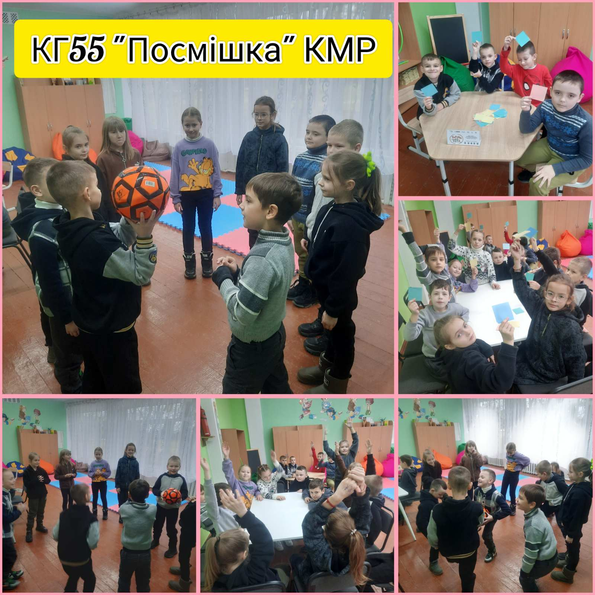
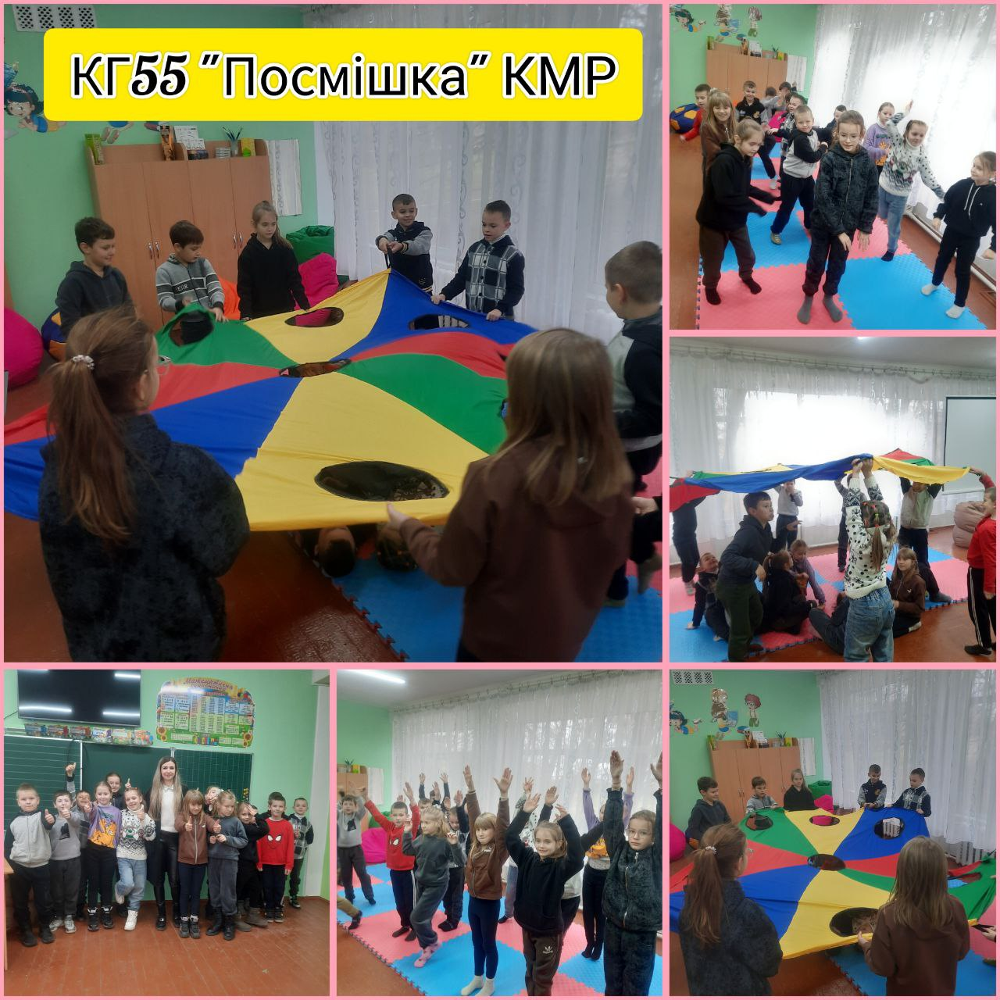

---
title: «Посмішка»
---

У КГ №55 КМР продовжує свою роботу проєкт «Посмішка», який не тільки дарує дітям радість, а й активно сприяє їх емоційному та соціальному розвитку. Психосоціальні заняття для учнів 3-Б класу стали справжнім простором для самовираження, розвитку емоційної компетентності та зміцнення стосунків серед однолітків. Проєкт «Посмішка» продовжує рухатися вперед, не зупиняючи свого розвитку, адже він є важливою складовою в процесі формування емоційно здорового та згуртованого колективу. Діти, що беруть участь у заняттях, відчувають себе частиною великої і дружної родини, де кожен підтримує одне одного. Такі ініціативи, безумовно, сприяють не лише розвитку фізичних, а й соціальних та емоційних якостей наших учнів, що є надзвичайно важливим для їх майбутнього! «Посмішка» не зупиняється, і ми раді, що разом з дітьми продовжуємо цей шлях розвитку та підтримки!

