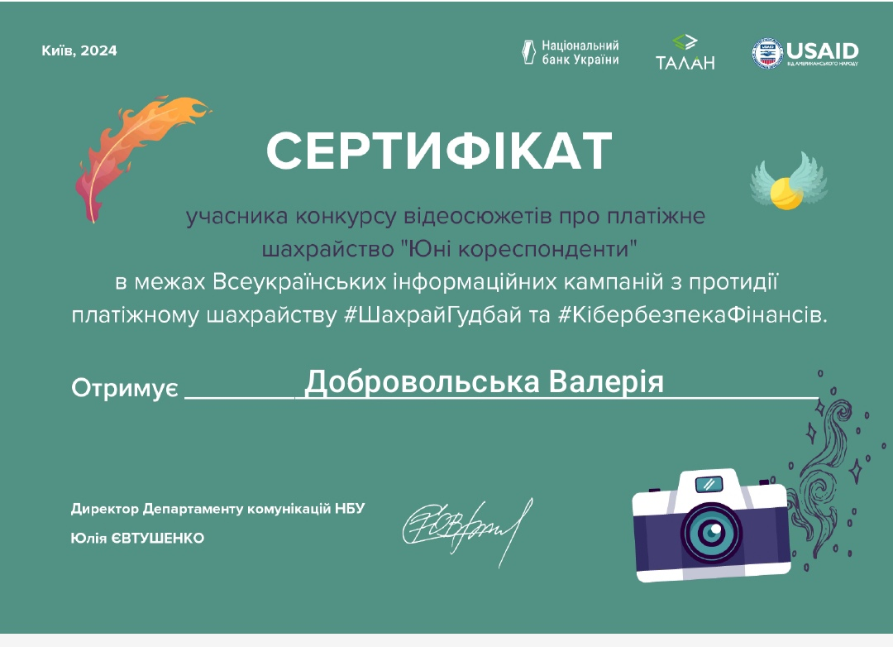

Актуальні питання сьогодення! Розбиралися, які бувають види шахрайства з платежами та як цього уникнути, здобувачі освіти 7-А класу КГ №55 КМР: Янча Ілона, Вдовіченко Анна та Бойко Михайло разом із класним керівником Добровольською В.Е.

Учасники освітнього процесу отримали сертифікати від Департаменту комунікацій Національного банку України. Це визнання стало результатом успішної участі в навчальних програмах та підвищенні рівня обізнаності щодо фінансових питань. Отримані сертифікати підтверджують знання та навички, необхідні для ефективного використання фінансових послуг та забезпечення фінансової грамотності.

