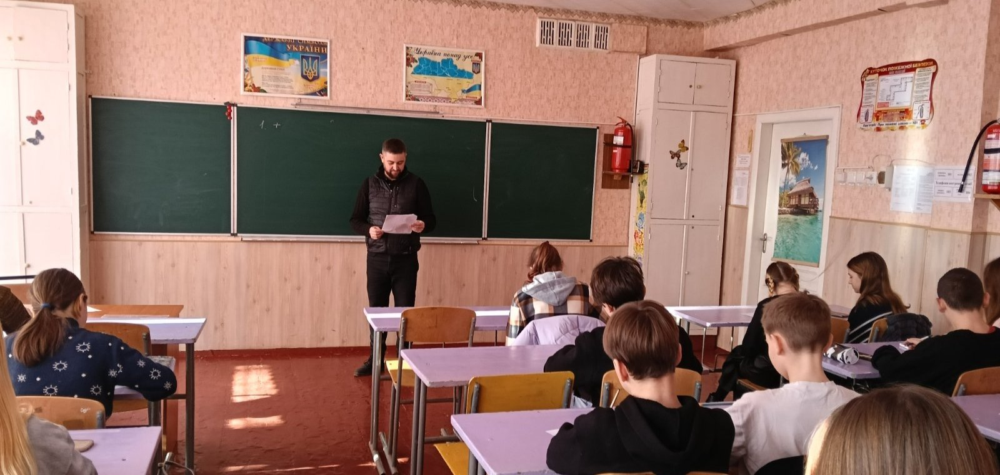

---
title: Тестування за методикою "Діагностика вад особистісного розвитку (ДВОР)" у 7-Б класі
---

12.02.2025 у КГ №55 КМР практичним психологом було проведено тестування за методикою "Діагностика вад особистісного розвитку (ДВОР)" у 7-Б класі. Ця методика дає змогу виявити та оцінити порушення в фізичному, соціальному, особистісному та духовному розвитку здобувачів освіти, що є важливим кроком для своєчасної корекції вад та забезпечення гармонійного розвитку кожної дитини.

