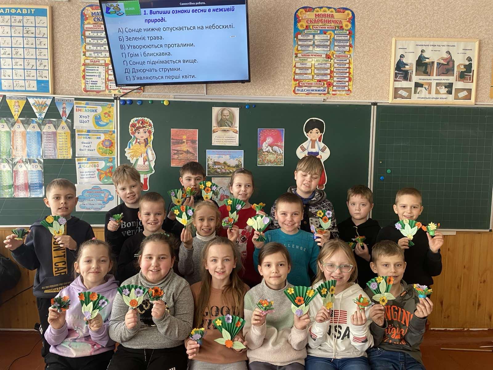

---
title: Майстер-клас "Кошик квіткового настрою"
---

06.03.2025 для учнів 2-А класу КГ №55 КМР Довмат Г.В. проведено весняний майстер-клас "Кошик квіткового настрою". Маленькі майстри проявили свою креативність і фантазію, виготовляючи не лише квіткові кошики, а й даруючи кожному виробу особливий настрій весни.

Ганна Василівна поділилась із учнями секретами технік декорування, а також розповіла про символіку квітів та важливість весняного настрою в житті кожної людини.

Такий майстер-клас став чудовою можливістю для дітей проявити свої творчі здібності та отримати позитивні емоції від спільної роботи.

