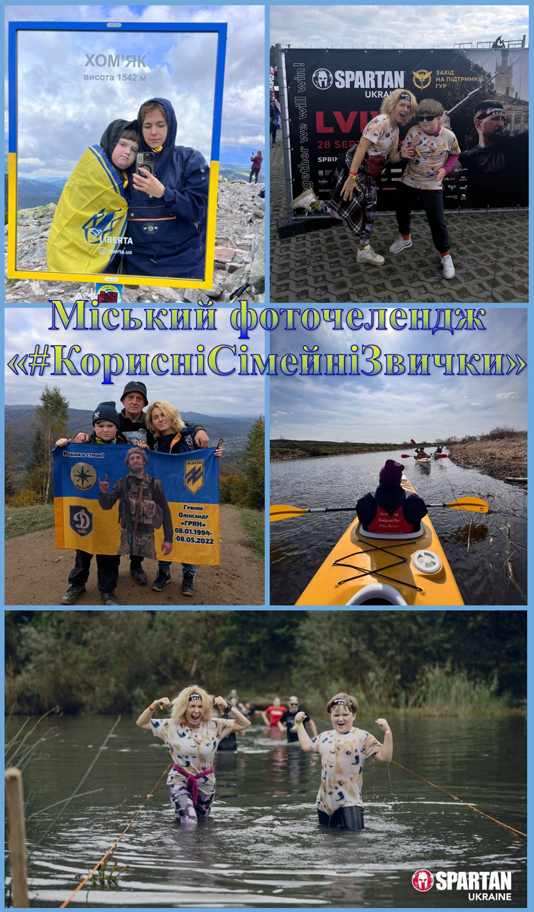

---
title: '"Підкорюємо вершини, вшановуємо героїв!"'
---

До Дня здоров'я родина Швецова Гліба, учня 5-А класу КГ №55, кожного року проводить особливі заходи, що об'єднують спорт і пам'ять. Це запливи на сапах і каяках, захоплюючий забіг у Спартанрейс і, звичайно ж, підкорення українських вершин – Говерли, Хом'яка та Маковиці. Ці акції мають глибокий сенс і є даниною пам'яті загиблому герою, захиснику Маріуполя Олександру Гряну, чиє життя забрала війна. Родина щороку піднімається на ці вершини в знак пошани та вшанування подвигу Олександра, щоб нагадати всім про важливість єдності, боротьби та пам'яті.

