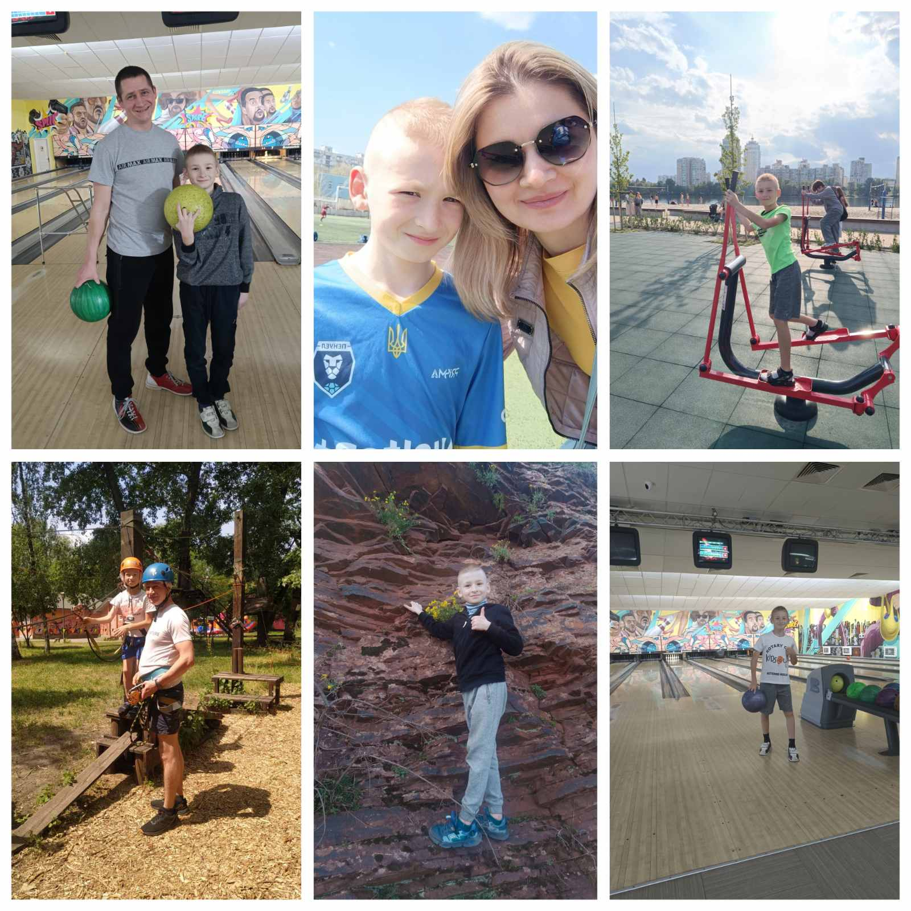

---
title: "Міський фоточелендж #КорисніСімейніЗвички до Дня здоров'я від родини Таран"
---

"Здорова сім'я — здорова нація, спорт об'єднує нас!" Родина Таран вірить, що саме через спільні спортивні заняття можна не лише покращити своє здоров'я, а й створити атмосферу гармонії та взаємопідтримки.

Міський фоточелендж #КорисніСімейніЗвички до Дня здоров'я від родини Таран! Денис, учень 4-Б класу КГ№55, разом із батьками організовує захоплюючі заходи, що об'єднують спортивні вподобання їхньої родини.

Родина Таран — справжні прихильники активного способу життя. Тато - любитель боулінгу, часто влаштовує дружні турніри вдома чи у спеціальних клубах, де вся родина може взяти участь. Мама обожнює йогу, тому ранкові заняття на свіжому повітрі стали чудовою традицією для всіх.

