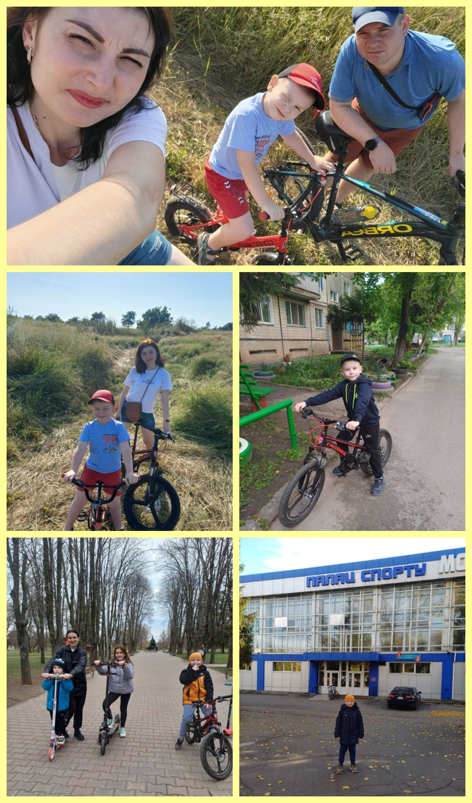

---
title: "Міський фоточелендж #КорисніСімейніЗвички до Дня здоров'я від родини Краснопольських"
---

"Будь здоровим, будь енергійним! 💪🚴‍♂️ Сонце, вода, повітря — твій секрет здоров’я! 🌞💧🌿"

1. Я вдячний за можливості, які надає мені спорт, і з ентузіазмом користуюся ними.
2. 2 – Б
3. Краснопольський Валентин
4. Бути здоровим — це вести активний спосіб життя, правильно харчуватися та дбати про режим дня.

Мати гарне здоров’я — так круто! Міцний імунітет допоможе ТОБІ з легкістю пройти будь-яке випробування: контрольну, шкільні змагання або турпохід.

Регулярні прогулянки та ігри на свіжому повітрі, повноцінний сон у поєднанні з фізичними навантаженнями зміцнюють здоров’я, розвивають волю, цілеспрямованість і витримку.

Здоровий означає веселий, бадьорий та життєрадісний. Щоб завжди бути у гарній формі, ми турбуємося про свій організм: робимо зарядку, не забуваємо про гігієну та корисну їжу, вчасно лягаємо спати. Сонце, вода та повітря — наші вірні помічники на шляху до відмінного здоров’я, міцного імунітету та краси.

