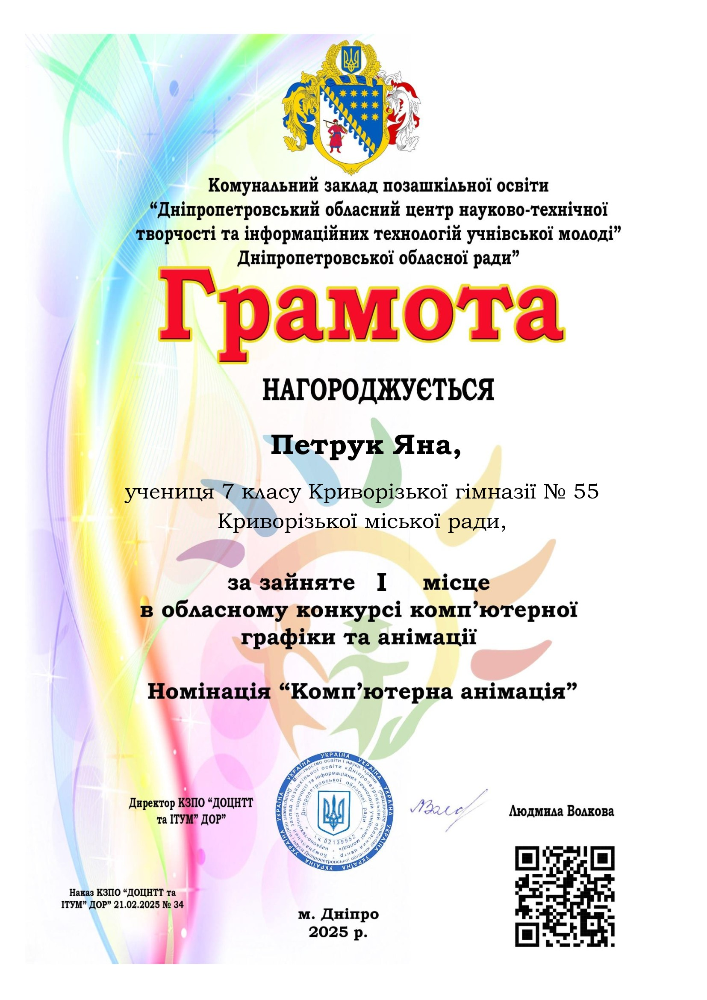
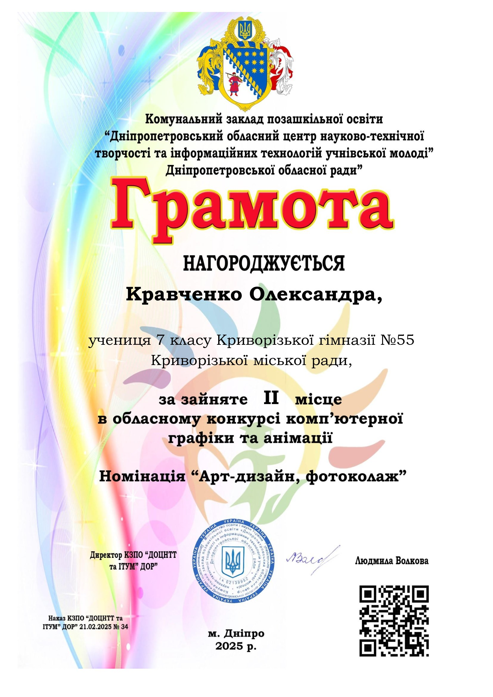

---
title: "Тріумф юних талантів: перемога на конкурсі комп'ютерної графіки та анімації"
---

Наші дівчатка знову підкорили творчий Олімп на рівні обласного конкурсу комп'ютерної графіки та анімації! Учениця 7-А класу Яна Петрук здобула І місце в номінації "Комп'ютерна анімація" із двосерійним яскравим мультфільмом-фентезі про боротьбу добра й зла. Олександра Кравченко з 7-Б посіла ІІ місце в конкурсі, виконавши складний чуттєвий малюнок в техніці аніме. Творчий керівник конкурсанток - Артемюк Н.А. Вітаємо талановитих дівчат - справжній скарб гімназії! Бажаємо наступних успіхів!

