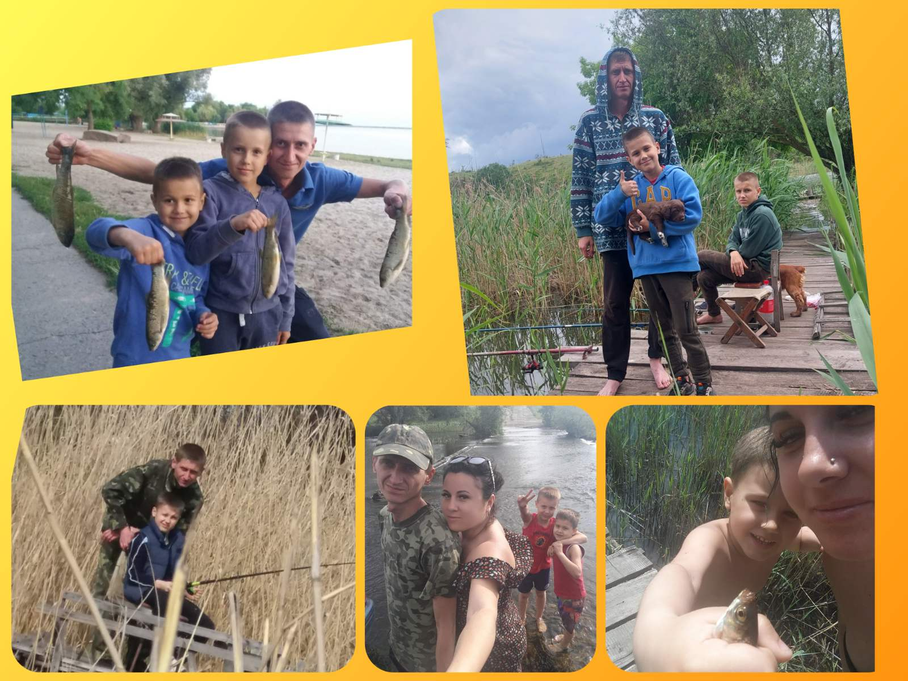

---
title: Міський фоточелендж #КорисніСімейніЗвички до Дня здоров'я
---

Алексієнко Нікіта, учень 7-А класу. Сімейне хобі "Природа й рибалка". "Природа й рибалка — це спосіб бути разом, відчути спокій і зарядитися енергією для всього життя! Ловися, рибко Велика й дуже Велика!"

