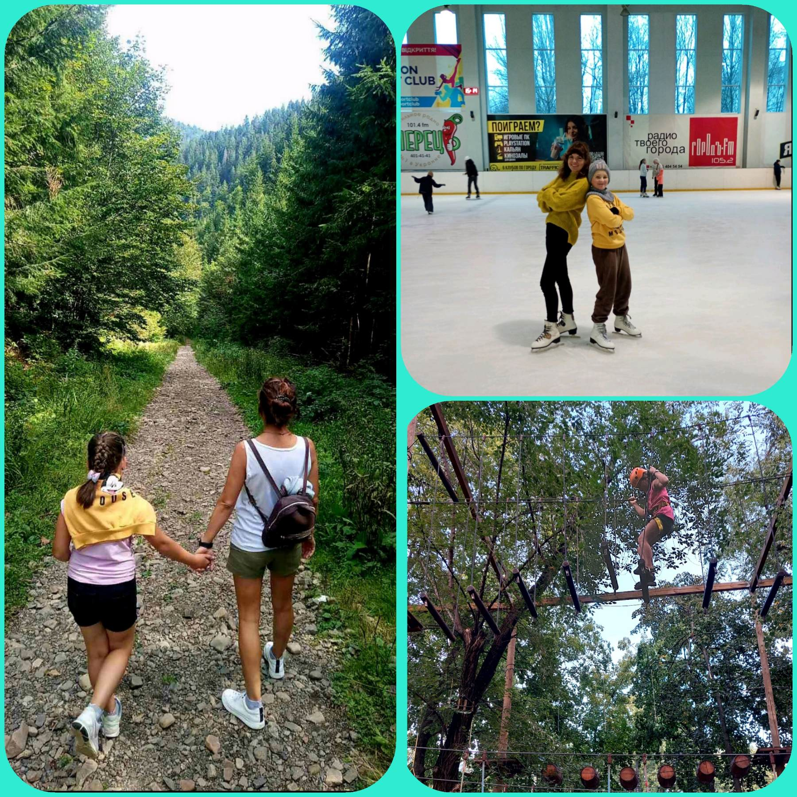

---
title: Міський фоточелендж #КорисніСімейніЗвички до Дня здоров'я
---

Гончарові відпочивають разом, насолоджуючись кожною миттю проведеною в колі сім'ї. Злата з 4-А класу вірить, що активний відпочинок із рідними допомагає розслабитись й заряджає енергією. Це час, коли можна забути про буденні турботи, а натомість наповнитись бадьорістю та оптимізмом. Такий відпочинок дає сили для нових звершень, адже спільні моменти радості та активності стають основою для успіху в майбутньому.

