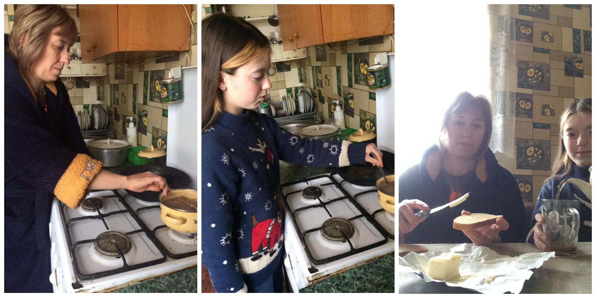

---
title: "Міський фоточелендж #КорисніСімейніЗвички до Дня здоров'я"
---

Дедалі більше українців прагне споживати здорову їжу: ретельно вивчає інформацію про склад продуктів і готує вдома смачні страви з натуральних продуктів, обмеживши додавання некорисних інгредієнтів, таких як сіль, цукор та надмірна кількість жиру.

Учениця 7-Б класу Вербова Вікторія разом з мамою піклуються про своє здоров'я, тому поживний сніданок родини - найкращий початок нового дня.

