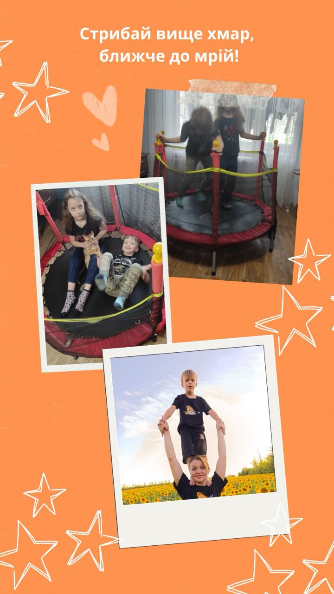

---
title: "Міський фоточелендж #КорисніСімейніЗвички до Дня здоров'я"
---

Родина Яковенка Артема, учня 1-Б класу. «Стрибай вище хмар, ближче до мрій!».

Здорові діти - це щасливі діти.

"Позитивні емоції, задоволення від досягнень і стосунків, а також особистісне зростання".

