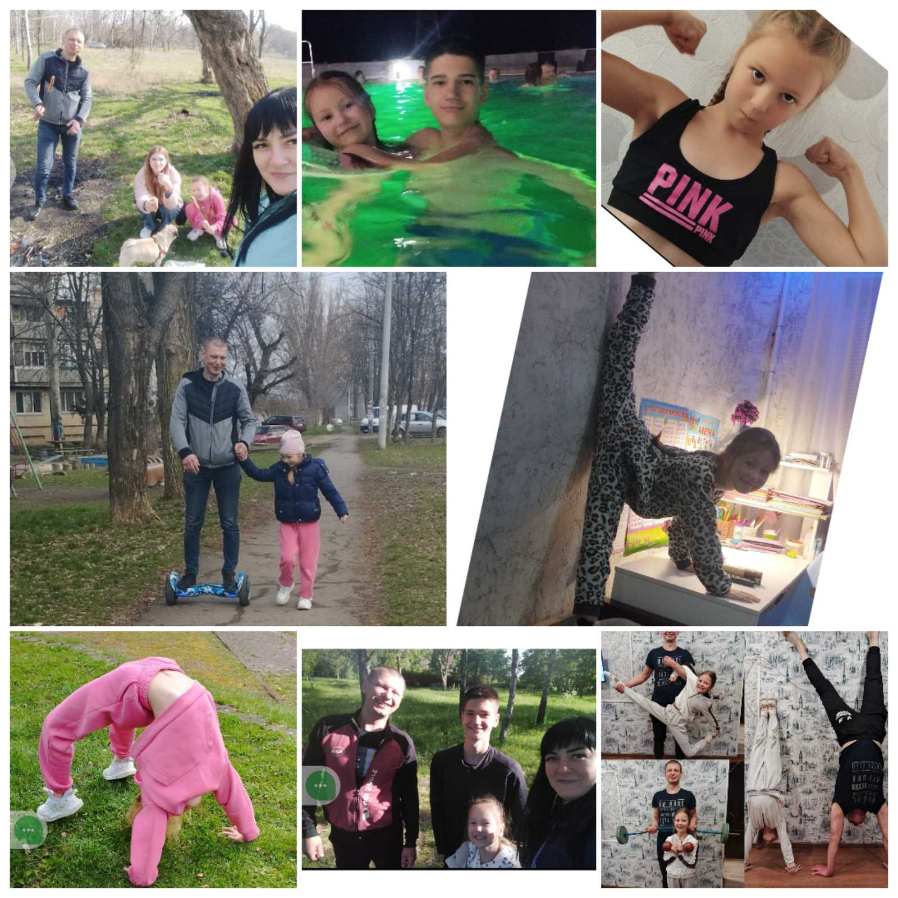

---
title: "Міський фоточелендж #КорисніСімейніЗвички до Дня здоров'я"
---

"Спорт — це здоровʼя!"

Сім’я Реви Кіри, учениці 2–Б класу, активно займається різними фізичними вправами, які позитивно впливають на здоровʼя. 

Спорт - це цікаве, захоплююче заняття, яке не тільки зміцнює м'язи і волю людини, але ще й дарує йому азарт, дух чесного змагання і впевнене прагнення до перемоги. Постійно займаючись, ми змінюємося в кращу сторону, наш характер зміцнюється, стає більш цілеспрямованим і твердим.

