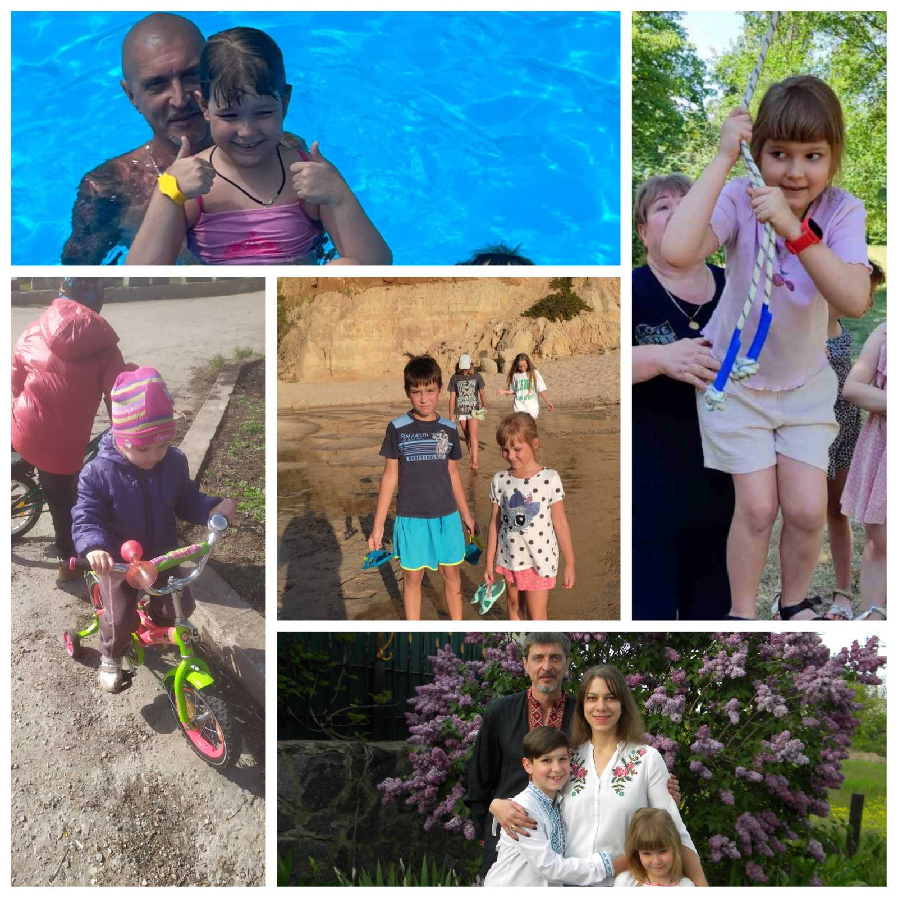

---
title: "Міський фоточелендж #КорисніСімейніЗвички до Дня здоров'я"
---

"Відпочинок – це найважливіша запорука здоров`я!"

Родина учениці 2-Б класу Вітряк Варвари любить відпочивати на природі в колі своєї дружньої сім’ї. Вихідні, канікули – це ідеальний час для активних розваг. Спільна прогулянка у парку, велосипедна поїздка або відпочинок на морі забезпечують веселу та енергійну атмосферу.

