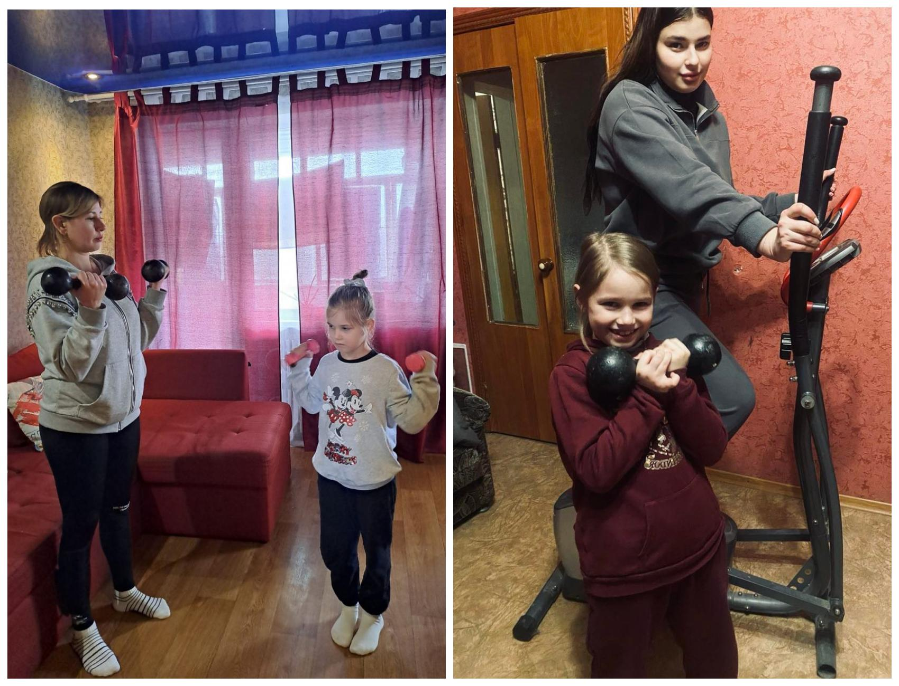

---
title: "Міський фоточелендж #КорисніСімейніЗвички до Дня здоров'я"
---

«Разом сильніші, разом вперед!»

Родина Горової Христини, 1-Б клас.

Вихідні - особливий час для спортивних пригод. Підтримка та заохочення рідних допомагають Христині не здаватися та отримувати задоволення від кожного руху. Завдяки таким щоденним спільним заняттям спорт для дівчинки - це весела гра та невід’ємна частина її щасливого дитинства, проведеного в колі люблячої родини.

