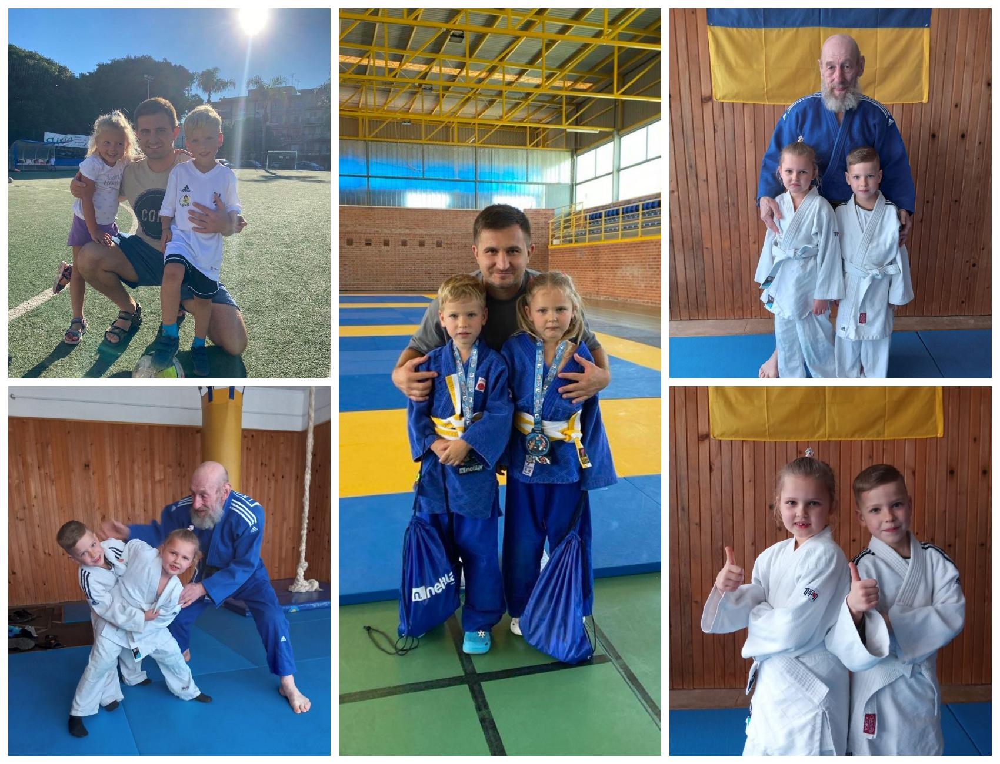

---
title: "Міський фоточелендж #КорисніСімейніЗвички до Дня здоров'я"
---

«Нехай спорт нас єднає, здоров’я міцним зростає!»

Родина Заярнюк Поліни, 1-Б клас. 

У кожній щасливій родині є свої маленькі, але важливі ритуали, які роблять її міцною та здоровою. Корисні звички,  такі як спільні сніданки без гаджетів,  корисна їжа,  прогулянка,  спорт, створюють атмосферу довіри та підтримки.

У шаленому ритмі сучасного життя знайти час для всього буває непросто, проте в родині Поліни твердо переконані, що це можливо. Дорослі розуміють, що власний приклад - найкращий мотиватор для дитини. Нехай спільні спортивні заняття стануть вашою доброю сімейною традицією, яка принесе радість, енергію та міцне здоров’я на довгі роки.

