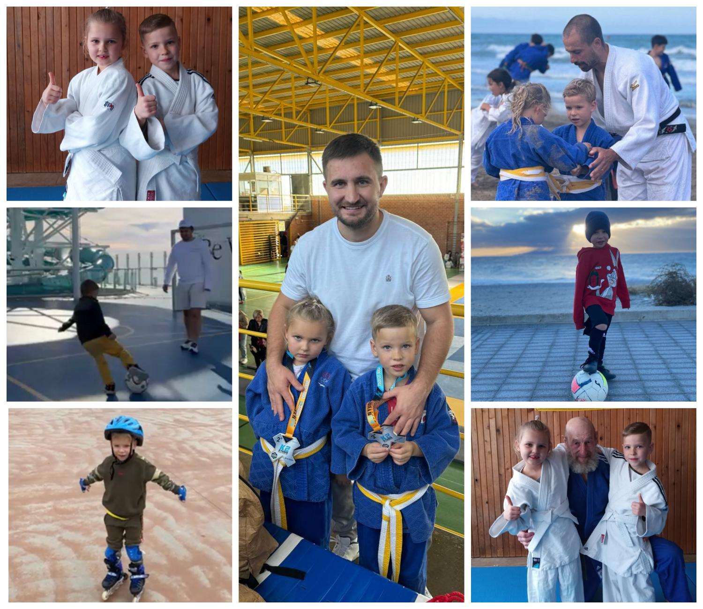

---
title: "Міський фоточелендж #КорисніСімейніЗвички до Дня здоров'я"
---

«Наша родина - спортивна сім’я, у русі - наша сила і наша броня!»

Родина Заярнюка Тимофія, 1-Б клас.

Сім’я Тимофія любить спорт.  Головне - сам процес і спільний час.  Під час занять родина спілкується,  підтримує одне одного та разом радіє навіть невеликим досягненням.  Ці моменти є безцінними, вони зміцнюють здоров’я. У родині Тимофія переважають цінності важливості активного способу життя.

